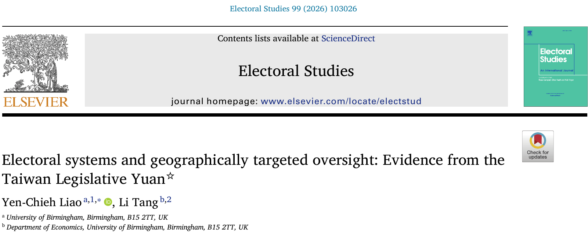
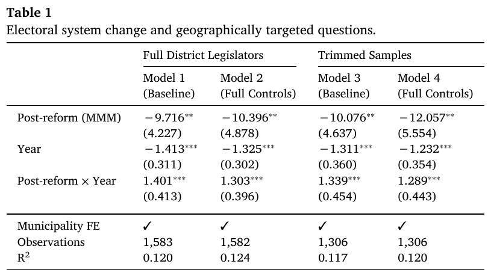
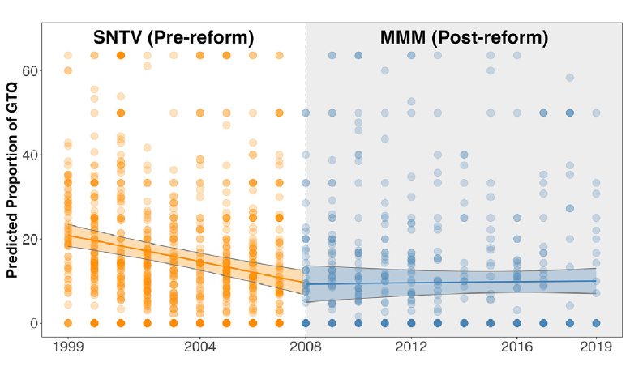

## Electoral reform and targeted oversight
:::::: {.slide-body .paper-title}
{fig-alt="Published title, authors, affiliations, and journal for Liao and Tang (2026), Electoral systems and geographically targeted oversight: Evidence from the Taiwan Legislative Yuan."}

**Did Taiwan's electoral reform change geographical targeting in written questions?**
::::::
::: {.source}
Liao and Tang (2026), Electoral Studies 99: 103026, p. 1. [DOI](https://doi.org/10.1016/j.electstud.2025.103026). CC BY 4.0; cropped title excerpt.
:::

## Fine-tuning a model for a research construct
:::::: {.slide-body}
**Pre-trained Chinese language model + labeled legislation**

| Stage | Number of legislative texts |
|---|---:|
| Training | 5,772 |
| Development | 722 |
| Final source-domain test | 722 |

7,216 texts: **2,004 particularistic / 5,212 non-particularistic**.

The paper compares Chinese BERT, CKIP ALBERT, and HFL MacBERT.
::::::
::: {.source}
Liao and Tang (2026), Section 4.1, pp. 4-5. [DOI](https://doi.org/10.1016/j.electstud.2025.103026).
:::

## A new text genre needs a new validation sample
:::::: {.slide-body}
**Training domain:** legislation. **Application domain:** written questions.

| Evaluation | Reported BERT result |
|---|---|
| 722 held-out legislative texts | Macro F1: 0.95; accuracy: 0.96 |
| About 400 human-coded questions | GTQ F1: 0.88 |
| Agreement on those questions | Pearson correlation: 0.82 |

**Correlation, F1, and accuracy are different quantities.**
::::::
::: {.source}
Liao and Tang (2026), Section 4.1 and footnote 9, p. 5. [DOI](https://doi.org/10.1016/j.electstud.2025.103026).
:::

## Predictions become a legislator-year outcome
:::::: {.slide-body}
**Question text → predicted GTQ label → legislator-year summary**

**GTQ percentage = 100 × targeted questions / all questions**

- Corpus: 63,748 questions from 402 district legislators.
- At the reported 0.95 confidence threshold: 8,992 GTQs.
- Join summaries to political and municipal characteristics.

The regression observation is a **legislator-year**, not a question.
::::::
::: {.source}
Liao and Tang (2026), Section 5.1 and footnote 12, p. 6. [DOI](https://doi.org/10.1016/j.electstud.2025.103026).
:::

## Regression tests the political argument
:::::: {.slide-body}
Outcome: **GTQ percentage for each legislator-year**.

- Post-reform indicator and a time trend.
- **Post-reform × time** interaction.
- Legislator controls and **municipality fixed effects**.
- Standard errors clustered by **municipality and year**.

Later models examine interactions with municipal socioeconomic conditions.
::::::
::: {.source}
Liao and Tang (2026), Section 5.2, Table 1, and equations 5.1-5.2, pp. 6-7. [DOI](https://doi.org/10.1016/j.electstud.2025.103026).
:::

## Reading the published regression table
:::::: {.slide-body .paper-figure}
{fig-alt="Coefficient panel from Table 1 in Liao and Tang (2026): post-reform, year, and their interaction across four specifications, including fixed effects, observations, and R squared."}

**Negative post-reform coefficient; positive interaction with time.**
::::::
::: {.source}
Liao and Tang (2026), Table 1, p. 6; coefficient panel excerpt, CC BY 4.0. Clustered SE in parentheses; ** p &lt; .05, *** p &lt; .01. [DOI](https://doi.org/10.1016/j.electstud.2025.103026).
:::

## The estimated pattern changes over time
:::::: {.slide-body .paper-figure}
{fig-alt="Figure 3 from Liao and Tang (2026), showing observed GTQ percentages and fitted trends around the 2008 reform, with confidence bands."}

The figure presents **Model 4 predictions**, not classification performance.
::::::
::: {.source}
Liao and Tang (2026), Figure 3, p. 7, CC BY 4.0; cropped plot. Bands: 95% confidence intervals. [DOI](https://doi.org/10.1016/j.electstud.2025.103026).
:::

## Two kinds of validity
:::::: {.slide-body}
| Measurement question | Research-design question |
|---|---|
| Do labels match the construct? | Does the comparison test the hypothesis? |
| Do errors vary by period or group? | What else changed around the reform? |
| How does the threshold affect GTQ rates? | How do trends and controls affect estimates? |

**Good prediction does not, by itself, establish a causal effect.**
::::::
::: {.source}
Teaching synthesis based on Liao and Tang (2026), Sections 4-6; proposed audit questions are course extensions. [DOI](https://doi.org/10.1016/j.electstud.2025.103026).
:::
