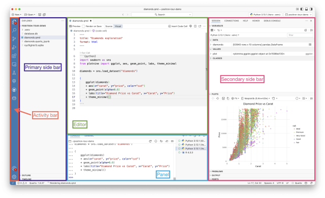
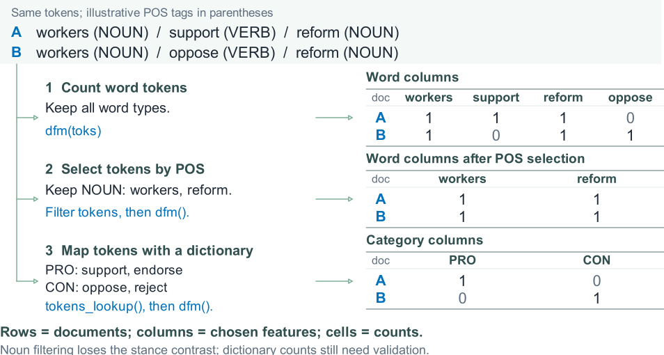
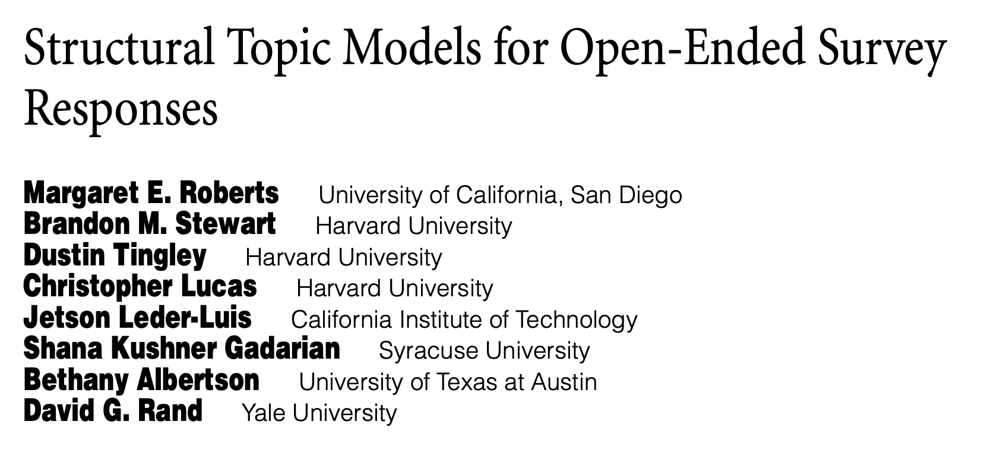
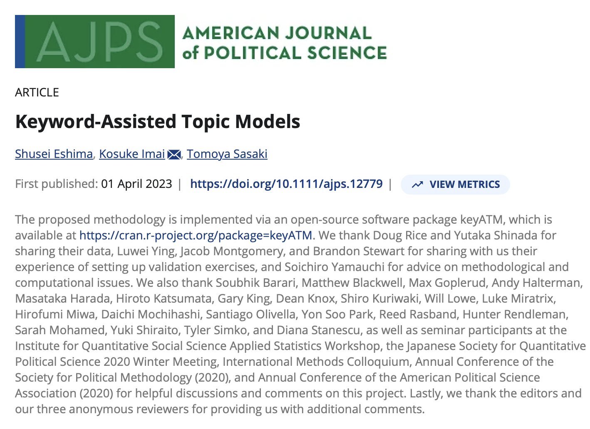
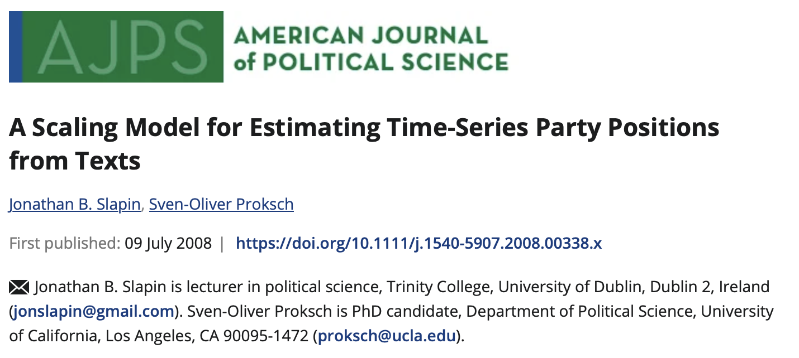
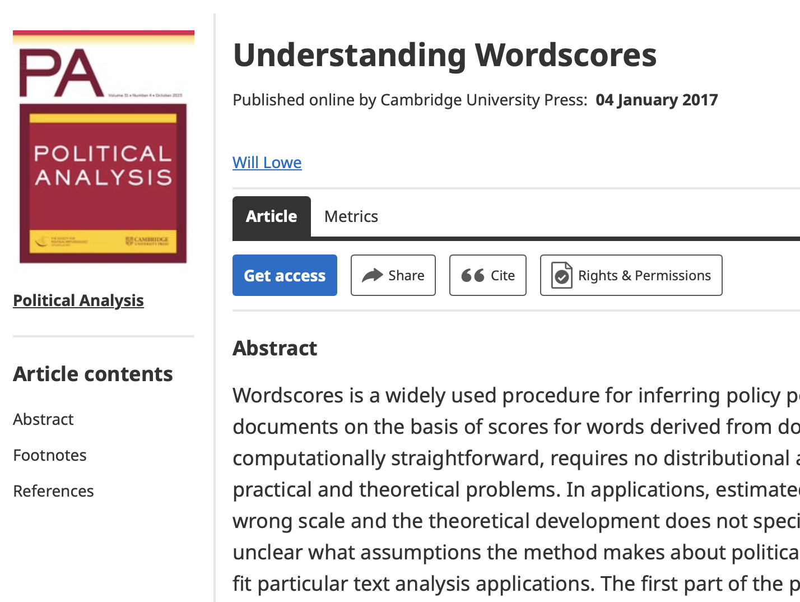
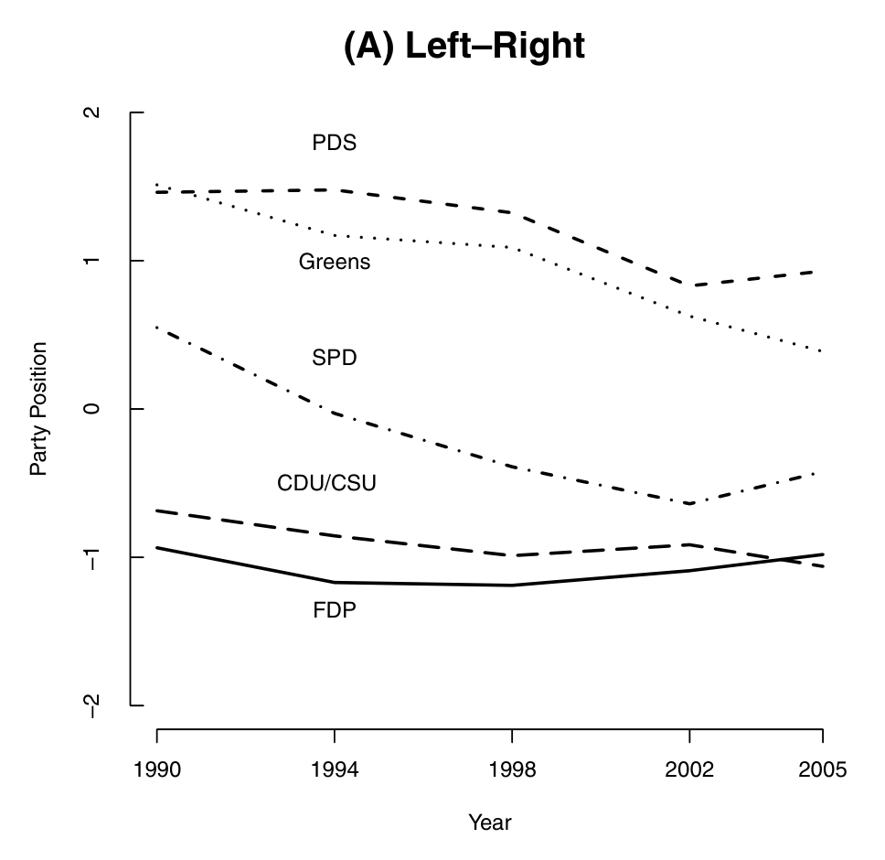
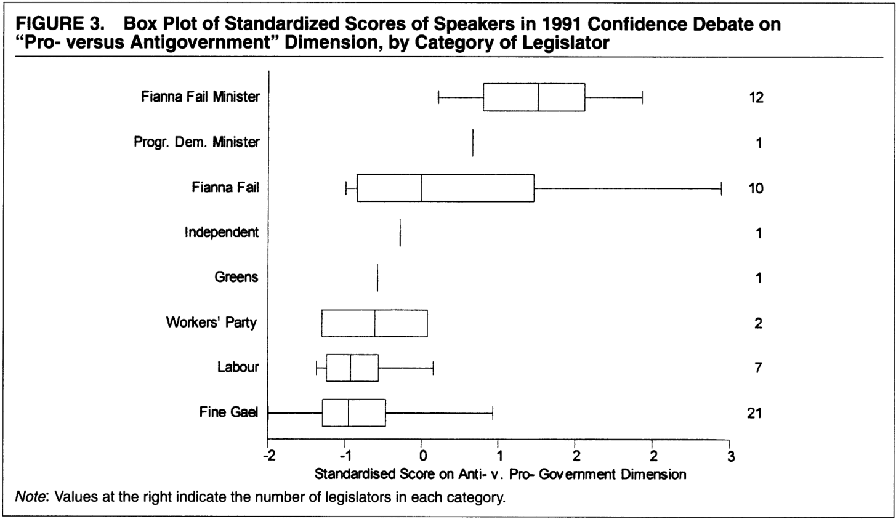
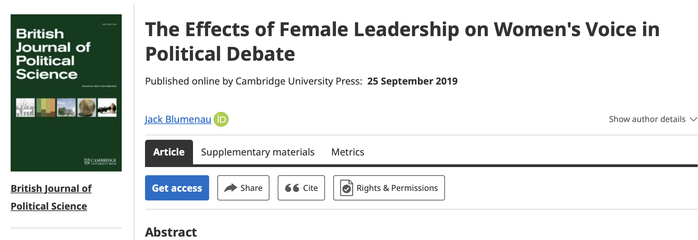
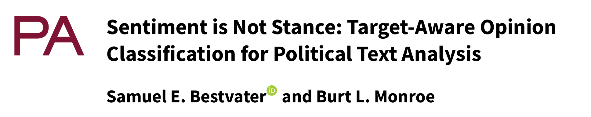

```{r}
#| label: setup
#| include: false
library(quanteda)
library(stringr)
library(knitr)
# Keep the original four teaching texts inside the lecture source.
raw <- data.frame(
  doc_id = c("d1", "d2", "d3", "d4"),
  text = c("Health workers need health services.",
           "The government supports health services.",
           "Workers do not support the policy.",
           "The government supports the policy."),
  stringsAsFactors = FALSE
)
corp <- corpus(raw, docid_field = "doc_id", text_field = "text")
toks <- tokens(corp, remove_punct = TRUE) |> tokens_tolower()
sw <- setdiff(stopwords("en"), c("not", "no", "nor"))
toks_content <- tokens_remove(toks, pattern = sw)
x <- dfm(toks_content)
x_weighted <- dfm_tfidf(x, scheme_tf = "count", scheme_df = "inverse", base = 10)
```
## Learning objectives

:::::: {.slide-body}

**Week 2: Text Preparation in R and Python: Collaborative Workflow**

- Set up RStudio and Positron for text analysis with R and Python.
- Organize code with GitHub and submit written coursework through shared Overleaf projects.
- Inspect supplied corpora and check project data feasibility: coverage, metadata, and access.
- Clean and tokenize text, build a DFM, and evaluate preprocessing choices.

::: {.key}
**Week 4 content introduced today:** Text preprocessing and document-feature matrices (DFMs). Week 4 builds on these with dictionaries, sentiment analysis, and validation.
:::

::::::

::: {.source}
Schoonvelde (2026); Welbers et al. (2017)
:::


## Five principles of quantitative text analysis

:::::: {.slide-body}

1. **Domain knowledge** defines the research problem and relevant evidence.
2. **Human judgment** guides interpretation and validation.
3. **Discovery and testing** require distinct stages.
4. **The task** determines which methods are useful.
5. **Validation** evaluates whether the measure fits the claim.

::::::

::: {.source}
Schoonvelde (2026); Grimmer et al. (2022)
:::


## Selecting documents: Chapter 4<br>(Grimmer et al. 2022)

:::::: {.slide-body}

**Classroom example:** measuring expressed preference for coffee.

| Design choice | Example |
|---|---|
| Target population | Thai-language public posts about coffee in a specified month |
| Quantity of interest | Share of those posts expressing positive preference for coffee |
| Observed corpus | Posts returned by one platform API and a specified keyword search |

**Found data:** document how the texts were produced, preserved and retrieved.

The next step is to examine what the collection process leaves out.

::::::

::: {.source}
Grimmer et al. (2022)
:::


## Selection bias begins before preprocessing

:::::: {.slide-body}

| Source of bias | Example | Research consequence |
|---|---|---|
| Resources | Well-funded groups archive more documents | Available texts overrepresent some actors |
| Incentives | Politicians publish strategically | Public statements differ from private beliefs |
| Medium | A platform limits length or visibility | The medium shapes expression |
| Retrieval | Searching only for “economy” | Relevant texts with other words disappear |

::::::

::: {.source}
Schoonvelde (2026); Grimmer et al. (2022)
:::


## Corpus boundaries and document units

:::::: {.slide-body}

| Decision | Example | What to record |
|---|---|---|
| Population | Parliamentary speech contributions | Chamber, actors, dates |
| Inclusion | All contributions in selected debates | Rule and exclusions |
| Document unit | One contribution per row | How segments were defined |
| Identifier | A persistent `doc_id` | Links to source and metadata |

Changing the unit to speaker-day or party-year changes the comparison.

::::::

::: {.source}
Schoonvelde (2026); Welbers et al. (2017)
:::


## Sources and import routes

:::::: {.slide-body}

| Source | Typical route | First check |
|---|---|---|
| Existing corpus | Download plus codebook | Coverage and sampling |
| TXT, CSV, TSV | `readr`, `data.table`, base R | Encoding and columns |
| JSON or API | `jsonlite`, `httr2` | Pagination and identifiers |
| HTML or XML | `rvest`, `xml2` | Boilerplate and structure |
| PDF or DOCX | `pdftools`, `readtext` | Reading order and document boundaries |

Scanned PDFs may need OCR before they contain usable text.

::::::

::: {.source}
Schoonvelde (2026); Welbers et al. (2017)
:::


## The R text-analysis toolkit in 2017

:::::: {.slide-body}

```{=html}
<div class="source-crop table-crop"></div>
```

::: {.small}
Historical package overview (2017). Package responsibilities and APIs have since changed.
:::

::::::

::: {.source}
Welbers et al. (2017)
:::


## Beyond 2017: annotation and embeddings

:::::: {.slide-body}

::: {.small}
| Tool / access from R | Model type | Output and use |
|---|---|---|
| **UDPipe 1**: R `udpipe` | Supervised annotation pipeline trained on a treebank | Tokens, lemmas, POS, dependency labels |
| **UDPipe 2**: R + REST API | Neural annotation with contextual embeddings | Linguistic annotations; current models use BERT-based representations |
| **Flair**: R `reticulate` + Python<br>(`flaiR`; Liao et al., 2023) | Contextual string embeddings or Transformer embeddings | Word/document vectors; models for NER, tagging and classification |
:::

::: {.small}
**FlairEmbeddings** uses character language models; **TransformerWordEmbeddings** uses models such as BERT.

R can prepare text, call these tools, and analyze the returned annotations or vectors.
:::

::::::

::: {.source}
Straka & Straková (2017); Straka (2018); Akbik et al. (2018, 2019); Liao et al. (2023)
:::


## quanteda, UDPipe, spaCy, and Flair

:::::: {.slide-body}

| Tool / access | Main emphasis | Typical output |
|---|---|---|
| **quanteda** (R) | Corpus management and feature analysis | Corpus, tokens, DFM; KWIC and TF-IDF |
| **UDPipe** (R / API) | Linguistic annotation using trained models | Tokens, lemmas, POS, UD dependency labels |
| **spaCy** (Python) | Configurable NLP pipelines | Tokens, POS, dependencies, named entities |
| **Flair** (Python)<br>**flaiR**: R wrapper for Python Flair | Embeddings and neural task models | Vectors; entity labels, POS, text categories |

**The tools can work together:** lemmas or selected annotations can become features in a quanteda DFM.

Capabilities overlap and depend on the language, model, and task.

::::::

::: {.source}
Benoit et al. (2018); Straka & Straková (2017); Explosion (n.d.); Akbik et al. (2019); Liao et al. (2023)
:::


## Beyond 2017: R and Python in one workflow

:::::: {.slide-body}

**One possible application:** compare the meanings of policy statements.

| Stage | Example tools | Contribution |
|---|---|---|
| Prepare in R | `stringr`, `quanteda` | Clean text and preserve document IDs |
| Represent in Python | `sentence-transformers` | Encode texts as semantic vectors |
| Evaluate in R | Statistical models and plots | Validate similarities and interpret patterns |

The languages can share a project. Each stage follows the research question.

::::::

::: {.source}
Sentence Transformers contributors (n.d.); Ushey et al. (2026)
:::


## Connecting R and Python

:::::: {.slide-body}

:::: {.columns}
::: {.column width="50%"}
### Python inside an R session

- R's **reticulate** package imports Python modules and calls their functions.
- I frequently used **reticulate** during my PhD (2018–2022).
- It converts supported objects between R and Python.
- Record the Python environment as well as R packages.
:::

::: {.column width="50%"}
### Separate scripts, shared data

- R and Python scripts exchange files such as CSV or Parquet.
- A stable **document ID** connects inputs and outputs.
- Check row order, encoding and data types at each handoff.
:::
::::

An IDE organizes the work. Object or file exchange connects the languages.

::::::

::: {.source}
Ushey et al. (2026); Posit (n.d.)
:::


## Positron: one IDE for R and Python

:::::: {.slide-body}

In 2022, **RStudio the company became Posit**, reflecting its broader support for data science across languages.

:::: {.columns}
::: {.column width="50%"}

- Posit developed **Positron** for multilingual data science.
- R and Python have built-in support, with consoles and data exploration.
- The **RStudio IDE** remains a separate, maintained product.

:::
::: {.column width="50%"}

{fig-alt="Annotated Positron layout showing its editor, console panel and sidebars, with a Python session and plot."}

::: {.small}
Our classroom examples use R.
:::

:::
::::

::::::

::: {.source}
Posit (2022, n.d.); Altman (2025)
:::


## The sequence of text-analysis operations

:::::: {.slide-body}

```{=html}
<div class="source-crop figure-crop"></div>
```

**The branch matters:** analysis can use a matrix, token positions, or other representations.

::::::

::: {.source}
Welbers et al. (2017)
:::


## Objects used in this session

:::::: {.slide-body}

| Object | Contents | Use |
|---|---|---|
| Data frame | Text, identifiers, metadata | Import checks and joins |
| `corpus` | Text with document variables | Subsets and metadata access |
| `tokens` | Sequences of tokens | Phrase matching and context inspection |
| `dfm` | Documents × features | Counts and weighted representations |

`stringr` handles strings. `quanteda` provides the corpus, tokens, and DFM workflow.

::::::

::: {.source}
Welbers et al. (2017); Schoonvelde (2026)
:::


## Import checks and encoding

:::::: {.slide-body}

```r
texts <- readLines("data/speeches.txt", encoding = "UTF-8")
length(texts)
head(texts)
```

- Confirm the source encoding rather than guessing from appearance.
- Inspect accented characters and Chinese text after import.
- Count missing texts and duplicated identifiers.
- Check whether a row is a line, paragraph, or whole document.

A UTF-8 argument does not repair a wrongly identified source encoding.

::::::

::: {.source}
Schoonvelde (2026); Welbers et al. (2017)
:::


## A parliamentary example

:::::: {.slide-body}

| Field | Value in the source slide |
|---|---|
| Date | 1997-01-20 |
| Speaker | William Hague |
| Party | Conservative |
| Agenda | Public Expenditure [Oral Answers To Questions > Wales] |

Text includes **[Interruption.]**, **DRAMATICALLY**, and **!!!**.

Which elements are metadata, meaningful language, or recording conventions?

::::::

::: {.source}
Schoonvelde (2026)
:::


## Cleaning depends on the research question

:::::: {.slide-body}

| Element | Possible treatment | Information at stake |
|---|---|---|
| Speaker and party | Store as metadata | Who speaks |
| `[Interruption.]` | Remove or extract into an indicator | Parliamentary interaction |
| Capitalization | Preserve or lowercase | Names and emphasis |
| Numbers | Keep, normalize, or remove | Years, budgets, percentages |
| Repeated punctuation | Preserve or simplify | Rhetorical emphasis |

Keep an untouched copy of the raw text.

::::::

::: {.source}
Schoonvelde (2026); Welbers et al. (2017)
:::


## String operations with stringr

:::::: {.slide-body}

| Function | Purpose | Example use |
|---|---|---|
| `str_detect()` | Test whether a pattern appears | Flag bracketed annotations |
| `str_extract()` | Retrieve the first match | Extract a year |
| `str_remove_all()` | Remove all matches | Delete selected annotations |
| `str_replace_all()` | Replace matches | Standardize separators |
| `str_squish()` | Normalize whitespace | Remove repeated spaces |
| `str_to_lower()` | Change case | Merge case variants |

::::::

::: {.source}
Schoonvelde (2026); Wickham (2025)
:::


## Bracket patterns and unintended deletion

:::::: {.slide-body}

```r
s <- "Trade [Commons] and jobs [Wales]"

str_remove_all(s, "\\[.*\\]")
# "Trade "

str_remove_all(s, "\\[[^\\[\\]]*\\]") |> str_squish()
# "Trade and jobs"
```

The first pattern spans from the first `[` to the last `]`.
The second handles separate, non-nested bracket groups.

::::::

::: {.source}
Schoonvelde (2026); Wickham (2025)
:::


## A cleaning example with an audit trail

:::::: {.slide-body}

```{r}
#| label: clean-agenda
agenda_raw <- "  Export Trade [Commons] -- vol. 407  "
agenda_clean <- agenda_raw |>
  str_remove_all("\\[[^\\[\\]]*\\]") |>
  str_to_lower() |>
  str_replace_all("[^[:alnum:][:space:]]", " ") |>
  str_squish()
agenda_clean
```

This rule preserves numbers and removes punctuation. Another task may need a different rule.

::::::

::: {.source}
Schoonvelde (2026)
:::


## A worked example: a small text corpus

:::::: {.slide-body}

```{r}
#| label: show-raw
#| echo: false
#| results: asis
kable(raw[c("doc_id", "text")], col.names = c("ID", "Synthetic text"))
```

These short texts let us inspect every token and verify every count.


::::::


## Creating a corpus

:::::: {.slide-body}

```r
library(quanteda)

corp <- corpus(
  raw,
  docid_field = "doc_id",
  text_field = "text"
)

docnames(corp)
docvars(corp)
```

Each row supplies one text. The remaining columns become document variables.

::::::

::: {.source}
Welbers et al. (2017); Schoonvelde (2026)
:::


## Tokens, types, and vocabulary

:::::: {.slide-body}

Text: **“Health services need health workers.”**

| Representation | Tokens | Distinct types |
|---|---:|---:|
| Case and punctuation retained | 6 | 6 |
| Lowercase, punctuation removed | 5 | 4 |

After normalization: `health`, `services`, `need`, `health`, `workers`

A **token** is an occurrence. A **type** is a distinct form under the chosen representation.

::::::

::: {.source}
Schoonvelde (2026); Welbers et al. (2017)
:::


## Tokens in R text analysis and LLMs

:::::: {.slide-body}

Both use **tokens**: units produced by tokenization for analysis or model processing.

| Comparison | Common R text-analysis workflow | Typical LLM workflow |
|---|---|---|
| Common units | Words; optionally characters or sentences | Often subwords; can include whole words, characters or byte units |
| Segmentation depends on | Package, tokenizer and your settings | The model's tokenizer and vocabulary |
| Main use | Word counts, DFM, TF-IDF, topic models | Token IDs used for model input and text generation |

**One word can become several LLM tokens.** R can call either kind of tokenizer; the workflow determines the unit.

::::::

::: {.source}
Benoit et al. (2018); Wolf et al. (2020)
:::


## Tokenizing with explicit choices

:::::: {.slide-body}

```r
toks <- tokens(corp, remove_punct = TRUE) |>
  tokens_tolower()

as.list(toks)[[1]]
```

```{r}
#| label: token-example
#| echo: false
as.list(toks)[[1]]
```

Inspect the output when texts contain hyphens, URLs, abbreviations, or non-Latin scripts.

::::::

::: {.source}
Schoonvelde (2026); Benoit et al. (2018)
:::


## Preprocessing choices and information loss

:::::: {.slide-body}

| Choice | Possible benefit | Possible loss |
|---|---|---|
| Lowercase | Merge `Health` and `health` | Proper-name distinctions |
| Remove stopwords | Reduce frequent function words | Negation or writing style |
| Stem or lemmatize | Merge some word forms | Differences in meaning |
| Trim rare features | Reduce vocabulary size | Rare but important concepts |

The relevant question is how the choice affects the intended measure.

::::::

::: {.source}
Schoonvelde (2026); Welbers et al. (2017)
:::


## Stopwords and negation

:::::: {.slide-body}

```r
sw <- setdiff(stopwords("en"), c("not", "no", "nor"))
toks_content <- tokens_remove(toks, pattern = sw)
```

| Rule applied to document d3 | Remaining tokens |
|---|---|
| Standard English stopword list | `workers support policy` |
| List that retains negation | `workers not support policy` |

Retaining `not` preserves a clue. A unigram model still needs a way to use its scope.

::::::

::: {.source}
Schoonvelde (2026); Welbers et al. (2017)
:::


## The bag-of-words representation

:::::: {.slide-body}

A DFM stores **one row per document** and **one column per feature**.

```{r}
#| label: selected-counts
#| echo: false
#| results: asis
m <- as.matrix(x[, c("health", "workers", "government", "policy", "not")])
kable(data.frame(ID = rownames(m), m, check.names = FALSE), row.names = FALSE)
```

Selected columns from our count DFM. Features can also represent phrases or other categories.

::::::

::: {.source}
Schoonvelde (2026); Welbers et al. (2017)
:::


## What word counts cannot recover

:::::: {.slide-body}

**“Workers support government.”**  
**“Government support workers.”**

The two sentences have the same lowercase unigram counts.

- Word order indicates who supports whom.
- Negation requires relationships between words.
- Ambiguous words need context.
- Sarcasm may depend on discourse beyond a sentence.

N-grams and syntax retain some additional information.

::::::

::: {.source}
Schoonvelde (2026); Welbers et al. (2017)
:::


## Multiword expressions

:::::: {.slide-body}

```r
phrase_toks <- tokens(
  "We support the armed forces.",
  remove_punct = TRUE
) |> tokens_tolower()

tokens_compound(
  phrase_toks,
  pattern = phrase("armed forces")
)
```

`armed_forces` becomes a single feature. Detect phrases before removing words that belong inside them.

::::::

::: {.source}
Schoonvelde (2026); Welbers et al. (2017)
:::


## Bigrams and operation order

:::::: {.slide-body}

```r
tokens("Workers do not support the policy.",
       remove_punct = TRUE) |>
  tokens_tolower() |>
  tokens_ngrams(n = 2)
```

`workers_do`, `do_not`, `not_support`, `support_the`, `the_policy`

Generate these before stopword removal if original adjacency matters. Deleting words first can create pairs that were never adjacent.

::::::

::: {.source}
Schoonvelde (2026); Welbers et al. (2017)
:::


## Collocations and grammatical features

:::::: {.slide-body}

| Feature strategy | Example | Required judgment |
|---|---|---|
| Known phrase | `armed_forces` | Which phrases matter? |
| Statistical collocation | Candidate such as `northern_ireland` | Is association substantively useful? |
| POS selection | Nouns, verbs, adjectives | Which grammatical roles fit the task? |

A frequent or associated word pair is a candidate feature. Inspect its uses before adding it to the measurement rule.

::::::

::: {.source}
Schoonvelde (2026); Welbers et al. (2017)
:::


## Stemming and lemmatization

:::::: {.slide-body}

| Method | Example | Limitation |
|---|---|---|
| Stemming | `studies` becomes `studi` | Stems may not be dictionary words |
| Lemmatization | `studies` may become `study` | Accuracy depends on language and context |
| Explicit replacement | Map `forces` to `force` | Only the supplied mapping is handled |

Neither approach guarantees correct semantic grouping. A dictionary built from full words may fail to match stemmed features.

::::::

::: {.source}
Schoonvelde (2026); Welbers et al. (2017)
:::


## Language and model requirements

:::::: {.slide-body}

::: {.columns}
::: {.column width="50%"}
### Language

- English whitespace is not a universal word boundary.
- Chinese segmentation needs inspection.
- Stopword and morphology tools are language specific.
:::
::: {.column width="50%"}
### Model

- A DFM may use word or phrase features.
- A pretrained model expects its own tokenizer.
- Preserve the input distinctions that model requires.
:::
:::

A BoW preprocessing recipe should not automatically become an LLM input recipe.

::::::

::: {.source}
Schoonvelde (2026); Welbers et al. (2017)
:::


## UDPipe models: Japanese, Chinese, and Thai

:::::: {.slide-body}

| Input language | Access from R | Model |
|---|---|---|
| Japanese | `udpipe`: local UDPipe 1 | `japanese-gsd` (UD 2.5) |
| Traditional Chinese | `udpipe`: local UDPipe 1 | `chinese-gsd` (UD 2.5) |
| Thai | `httr2`: UDPipe 2 API | `thai-tud` (UD 2.17) |

- All three provide segmented `token` and predicted `upos` (POS).
- Dependency parsing adds heads and relation labels.
- `lemma` is a predicted base form; this Thai model returns `_` (unavailable).

**Instructor demonstration:** interpret the prepared model outputs shown in these slides.

::::::

::: {.source}
Wijffels & Straka (2026); Straka (2018); Universal Dependencies contributors (n.d.)
:::


## Annotating UTF-8 text with UDPipe

:::::: {.slide-body}

```r
library(udpipe)
# Set model_path to a downloaded Chinese-GSD model.
zh_model <- udpipe_load_model(model_path)
ann_zh <- udpipe_annotate(zh_model, x = "我喜歡咖啡。",
  doc_id = "zh_coffee", parser = "default") |> as.data.frame()
ann_zh[c("token_id", "token", "upos",
         "head_token_id", "dep_rel")]
```

Chinese: `chinese-gsd`; English: `english-ewt`; Thai: R + UDPipe 2 API.

- `parser = "default"` adds dependency parsing to tokens and POS.
- `head_token_id` identifies the head; `dep_rel` labels the relationship. Head `0` marks the sentence root.

::::::

::: {.source}
Wijffels & Straka (2026); Universal Dependencies contributors (n.d.)
:::


```{r}
#| label: tokenization-comparison-data
#| include: false
# Displayed token/POS predictions transcribed from the retained presenter HTML.
token_rows <- data.frame(
  language = c("Thai", "Thai", "Thai", "Japanese", "Japanese", "Japanese", "Japanese", "Japanese", "Japanese", "Chinese", "Chinese", "Chinese"),
  token = c("ฉัน", "ชอบ", "กาแฟ", "私", "は", "コーヒー", "が", "好き", "です", "我", "喜歡", "咖啡"),
  upos = c("PRON", "VERB", "NOUN", "PRON", "ADP", "NOUN", "ADP", "ADJ", "AUX", "PRON", "VERB", "NOUN"),
  stringsAsFactors = FALSE
 )
thai_tokens <- token_rows$token[token_rows$language == "Thai"]
with_pos <- function(language) {
  rows <- token_rows[token_rows$language == language, ]
  paste0(rows$token, " (", rows$upos, ")")
}
thai_labels <- with_pos("Thai")
japanese_labels <- with_pos("Japanese")
chinese_labels <- with_pos("Chinese")
stopifnot(length(thai_tokens) == 3L)
```

## Word tokenization across languages {.three-languages .pos-labels}

:::::: {.slide-body}

Same meaning: “I like coffee.”

:::: {.columns}
::: {.column width="33%"}
### Thai

::: {.method-label}
R: httr2 + UDPipe 2 API
:::

::: {.original-text lang="th"}
ฉันชอบกาแฟ
:::

::: {.token-label}
Tokens (POS)
:::

::: {.token-result lang="th"}
`r thai_labels[1]`  
`r thai_labels[2]`  
`r thai_labels[3]`
:::

**`r length(thai_tokens)` tokens**

The Thai model finds word boundaries.
:::

::: {.column width="33%"}
### Japanese

::: {.method-label}
R: udpipe (japanese-gsd)
:::

::: {.original-text lang="ja"}
私はコーヒーが好きです。
:::

::: {.token-label}
Tokens (POS)
:::

::: {.token-result lang="ja"}
`r paste(japanese_labels[1:2], collapse = " / ")`  
`r paste(japanese_labels[3:4], collapse = " / ")`  
`r paste(japanese_labels[5:6], collapse = " / ")`
:::

**6 tokens**

Particles and auxiliaries remain separate tokens.
:::

::: {.column width="33%"}
### Chinese

::: {.method-label}
R: udpipe (chinese-gsd)
:::

::: {.original-text lang="zh-Hant"}
我喜歡咖啡。
:::

::: {.token-label}
Tokens (POS)
:::

::: {.token-result lang="zh-Hant"}
`r chinese_labels[1]`  
`r chinese_labels[2]`  
`r chinese_labels[3]`
:::

**3 tokens**

Multi-character words can form single tokens.
:::
::::

::: {.comparison-note}
POS = part of speech. Counts exclude punctuation.
:::

::::::

::: {.source}
Straka & Straková (2017); Straka (2018)
:::


## Dependency labels across languages {.dependency-labels}

:::::: {.slide-body}

```{r}
#| label: dependency-label-data
#| include: false
# Displayed dependency predictions transcribed from retained HTML; punctuation was omitted in that display.
dependency_rows <- data.frame(
  language = c("Traditional Chinese", "Traditional Chinese", "Traditional Chinese", "English", "English", "English", "Thai", "Thai", "Thai"),
  token_id = c(1L, 2L, 3L, 1L, 2L, 3L, 1L, 2L, 3L),
  token = c("我", "喜歡", "咖啡", "I", "like", "coffee", "ฉัน", "ชอบ", "กาแฟ"),
  upos = c("PRON", "VERB", "NOUN", "PRON", "VERB", "NOUN", "PRON", "VERB", "NOUN"),
  head_token_id = c(2L, 0L, 2L, 2L, 0L, 2L, 2L, 0L, 2L),
  dep_rel = c("nsubj", "root", "obj", "nsubj", "root", "obj", "nsubj", "root", "obj"),
  stringsAsFactors = FALSE
 )
dependency_example <- function(language) {
  a <- dependency_rows[dependency_rows$language == language &
                       dependency_rows$upos != "PUNCT", ]
  a <- a[order(as.integer(a$token_id)), ]
  stopifnot(nrow(a) == 3L, all(nzchar(a$dep_rel)))
  a
}
dependency_table <- function(language) {
  a <- dependency_example(language)
  kable(data.frame(`Token (POS)` = paste0(a$token_id, " ", a$token,
                                          " (", a$upos, ")"),
                   dep_rel = a$dep_rel, check.names = FALSE),
        row.names = FALSE)
}
dependency_heads <- function(language) {
  paste(dependency_example(language)$head_token_id, collapse = " / ")
}
```

Same meaning: "I like coffee."

:::: {.columns}
::: {.column width="33%"}
### Chinese (Traditional)

::: {.method-label}
R: udpipe (chinese-gsd)
:::

::: {.original-text lang="zh-Hant"}
我喜歡咖啡。
:::

::: {.dependency-rows lang="zh-Hant"}
```{r}
#| echo: false
#| results: asis
dependency_table("Traditional Chinese")
```
:::

::: {.head-ids}
Head IDs: `r dependency_heads("Traditional Chinese")`
:::
:::

::: {.column width="33%"}
### English

::: {.method-label}
R: udpipe (english-ewt)
:::

::: {.original-text lang="en"}
I like coffee.
:::

::: {.dependency-rows lang="en"}
```{r}
#| echo: false
#| results: asis
dependency_table("English")
```
:::

::: {.head-ids}
Head IDs: `r dependency_heads("English")`
:::
:::

::: {.column width="33%"}
### Thai

::: {.method-label}
R: httr2 + UDPipe 2 API
:::

::: {.original-text lang="th"}
ฉันชอบกาแฟ
:::

::: {.dependency-rows lang="th"}
```{r}
#| echo: false
#| results: asis
dependency_table("Thai")
```
:::

::: {.head-ids}
Head IDs: `r dependency_heads("Thai")`
:::
:::
::::

::: {.dependency-legend}
**nsubj** = nominal subject; **root** = sentence root; **obj** = object.

Head 0 marks the root; other IDs point to a token in the same sentence.

Punctuation is omitted from this display.
:::

::::::

::: {.source}
Straka & Straková (2017); Straka (2018); Universal Dependencies contributors (n.d.)
:::


## Japanese: observed segmentation {.annotation-detail}

:::::: {.slide-body}

**政府は医療従事者を支援する。**

::: {.tight}
```{r}
#| label: japanese-annotation
#| echo: false
#| results: asis
# Exact displayed UDPipe predictions retained from presenter HTML, including the Chinese model errors.
ann_multi <- data.frame(
  doc_id = c("ja_01", "ja_01", "ja_01", "ja_01", "ja_01", "ja_01", "ja_01", "ja_01", "zh_01", "zh_01", "zh_01", "zh_01", "zh_01", "zh_01", "zh_02", "zh_02", "zh_02", "zh_02", "zh_02", "zh_02", "zh_02"),
  token_id = c(1L, 2L, 3L, 4L, 5L, 6L, 7L, 8L, 1L, 2L, 3L, 4L, 5L, 6L, 1L, 2L, 3L, 4L, 5L, 6L, 7L),
  token = c("政府", "は", "医療", "従事者", "を", "支援", "する", "。", "政府", "支持", "醫療", "工作", "者", "。", "政府", "不", "支持", "刪減", "醫療", "預算", "。"),
  lemma = c("政府", "は", "医療", "従事者", "を", "支援", "する", "。", "政府", "支持", "醫療", "工作", "者", "。", "政府", "不", "支持", "刪減", "醫療", "預算", "。"),
  upos = c("NOUN", "ADP", "NOUN", "NOUN", "ADP", "VERB", "AUX", "PUNCT", "NOUN", "NOUN", "NOUN", "VERB", "PART", "PUNCT", "NOUN", "ADV", "VERB", "VERB", "NOUN", "NOUN", "PUNCT"),
  head_token_id = c(6L, 1L, 4L, 6L, 4L, 0L, 6L, 6L, 5L, 5L, 5L, 5L, 0L, 5L, 3L, 3L, 0L, 3L, 6L, 4L, 3L),
  dep_rel = c("nsubj", "case", "compound", "obj", "case", "root", "aux", "punct", "nmod", "nmod", "nmod", "compound", "root", "punct", "nsubj", "advmod", "root", "xcomp", "nmod", "obj", "punct"),
  stringsAsFactors = FALSE
 )
ja_rows <- subset(ann_multi, doc_id == "ja_01")
annotation_columns <- c("token_id", "token", "lemma", "upos",
                        "head_token_id", "dep_rel")
annotation_table <- function(a) {
  stopifnot(all(annotation_columns %in% names(a)),
            all(nzchar(a$dep_rel)), all(a$dep_rel != "_"))
  kable(a[annotation_columns], row.names = FALSE,
        col.names = c("ID", "token", "lemma", "upos", "head", "dep_rel"),
        align = c("r", "l", "l", "l", "r", "l"))
}
annotation_table(ja_rows)
```
:::

::: {.small}
**Dependency parsing:** `head` = head token ID (0 = root); `dep_rel` = relation.
:::

::::::

::: {.source}
Straka & Straková (2017)
:::


## Traditional Chinese: observed segmentation {.annotation-detail}

:::::: {.slide-body}

**政府支持醫療工作者。**

::: {.tight}
```{r}
#| label: traditional-chinese-annotation
#| echo: false
#| results: asis
zh_rows <- subset(ann_multi, doc_id == "zh_01")
annotation_table(zh_rows)
```
:::

::: {.small}
**Dependency parsing:** `head` = head token ID (0 = root); `dep_rel` = relation.

**Model errors:** 支持 is tagged `NOUN`; 者 is predicted as `root`. Inspect the original sentence before interpreting these outputs.
:::

::::::

::: {.source}
Straka & Straková (2017); Universal Dependencies contributors (n.d.)
:::


## Negation and POS-based feature selection {.annotation-detail}

:::::: {.slide-body}

**政府不支持刪減醫療預算。**

::: {.tight}
```{r}
#| label: chinese-negation
#| echo: false
#| results: asis
zh_negative <- subset(ann_multi, doc_id == "zh_02")
annotation_table(zh_negative)
```
:::

::: {.small}
**Dependency parsing:** `head` = head token ID (0 = root); `dep_rel` = relation.  
Keeping only `NOUN` and `VERB` removes **不** (`ADV`), attached to **支持** (ID 3) by `advmod`. The feature list loses negation.
:::

::::::

::: {.source}
Straka & Straková (2017)
:::


## From Thai syntax to a research measure {.thai-dependency}

:::::: {.slide-body}

<span lang="th">ฉันชอบกาแฟ</span> &nbsp; “I like coffee.”

:::: {.columns}
::: {.column width="50%"}
### Dependency relations

{fig-alt="Actual Thai dependency tree: ROOT points to ชอบ (VERB, like). ชอบ points to ฉัน (PRON, I) with nsubj and to กาแฟ (NOUN, coffee) with obj."}

::: {.graph-note}
Arrows run from head to dependent.
:::
:::

::: {.column width="50%"}

- **Language relationships**  
  POS marks word classes. Dependencies link a subject to a predicate and target.
- **Operationalize preference**  
  Link the subject to “like” and its object. Check that the statement is affirmative.
- **Code this example**  
  Coffee: positive preference = 1.
- **Research question**  
  Which targets receive more expressions of positive preference?

:::
::::

::: {.measure-note}
Corpus measure: share of documents mentioning a target that express positive preference.
:::

::::::

::: {.source}
Straka (2018); Universal Dependencies contributors (n.d.)
:::


## UDPipe annotations as quanteda tokens

:::::: {.slide-body}

```r
# Assume ann_multi contains an annotation table.
a <- subset(ann_multi, upos != "PUNCT")
a <- a[order(a$doc_id, a$sentence_id,
             as.integer(a$token_id)), ]

ja_tokens <- split(a$token[a$doc_id == "ja_01"],
                   a$doc_id[a$doc_id == "ja_01"])
ja_dfm <- dfm(as.tokens(ja_tokens), tolower = FALSE)
```

Use `as.tokens()` to preserve the existing segmentation. Build the Chinese DFM from the Chinese documents in the same way.

Code illustration: annotations → tokens → DFM.

::::::

::: {.source}
Benoit et al. (2018); Wijffels & Straka (2026)
:::


## Tokens become DFM features {.token-dfm}

:::::: {.slide-body}

::: {.token-dfm-figure}
{fig-alt="Two synthetic documents, A: Workers support reform; B: Workers oppose reform, feed three DFM routes. Word counts retain workers, support, reform, oppose. Keeping NOUN tokens retains workers and reform, making both document rows identical. A dictionary maps support or endorse to PRO and oppose or reject to CON, producing A: PRO 1 CON 0 and B: PRO 0 CON 1. Rows are documents, columns are chosen features, and cells are counts. POS tags are hand-labelled illustrations."}
:::

::::::

::: {.source}
Benoit et al. (2018)
:::


## Building and inspecting the DFM

:::::: {.slide-body}

```r
x <- dfm(toks_content)
dim(x)
topfeatures(x, 6)
```

```{r}
#| label: dfm-diagnostics
#| echo: false
dim(x)
topfeatures(x, 6)
```

Rows retain the document IDs. The full DFM includes features beyond the selected columns shown earlier.

::::::

::: {.source}
Schoonvelde (2026); Welbers et al. (2017)
:::


## Term frequency and document frequency

:::::: {.slide-body}

| Feature | Total occurrences | Documents containing it |
|---|---:|---:|
| `health` | 3 | 2 |
| `workers` | 2 | 2 |
| `not` | 1 | 1 |

```r
docfreq(x)
x_trim <- dfm_trim(x, min_docfreq = 2,
                  docfreq_type = "count")
```

This threshold removes `not`. A rare feature can still carry essential meaning.

::::::

::: {.source}
Schoonvelde (2026); Welbers et al. (2017)
:::


## Counts, binary indicators, and TF-IDF

:::::: {.slide-body}

| Representation | Meaning of a cell | Possible use |
|---|---|---|
| Count | Number of occurrences | Frequency-based measurement |
| Binary | Whether the feature appears | Presence-based comparison |
| TF-IDF | Count adjusted for corpus prevalence | Document retrieval or comparison |

The choice changes what repeated words contribute. Model requirements may constrain which representation is appropriate.

::::::

::: {.source}
Schoonvelde (2026); Welbers et al. (2017)
:::


## TF-IDF with a stated formula

:::::: {.slide-body}

For this lesson, use raw counts and a base-10 logarithm:

::: {.mathline}
TF-IDF(d, t) = count(d, t) × log₁₀(N / df(t))
:::

- **N** is the number of documents in the reference corpus.
- **df(t)** counts documents that contain feature *t*.
- A feature in every document receives IDF = 0 under this formula.

Different normalizations and smoothing rules produce different weights.

::::::

::: {.source}
Schoonvelde (2026); Benoit et al. (2018)
:::


## TF-IDF in the worked example

:::::: {.slide-body}

For `health`, **N = 4**, **df = 2**, so IDF = log₁₀(2) ≈ **0.3010**.

| Document | Count of `health` | TF-IDF |
|---|---:|---:|
| d1 | 2 | 0.6021 |
| d2 | 1 | 0.3010 |
| d3 | 0 | 0 |
| d4 | 0 | 0 |

```r
x_weighted <- dfm_tfidf(x, scheme_tf = "count",
                      scheme_df = "inverse", base = 10)
```

::::::

::: {.source}
Benoit et al. (2018)
:::


## Context checks with KWIC

:::::: {.slide-body}

```r
kwic(toks, pattern = "support*", window = 3)
```

::: {.small}
```{r}
#| label: kwic-table
#| echo: false
#| results: asis
k <- as.data.frame(kwic(toks, pattern = "support*", window = 3))
kable(k[c("docname", "pre", "keyword", "post")], row.names = FALSE)
```
:::

Read the context around a matched term before treating its count as support for a policy.

::::::

::: {.source}
Welbers et al. (2017); Benoit et al. (2018)
:::


## Wrap-up: DFM, KWIC, TF-IDF

:::::: {.slide-body}

::: {.small}
| Tool | What it lets you do |
|---|---|
| **DFM** | Represent document features for comparison and modeling. |
| **KWIC** | Read terms in context and check what feature counts mean. |
| **TF-IDF** | Emphasize distinctive terms for retrieval and similarity. |
:::

**Wordfish** is an unsupervised method for scaling texts on **one dimension**.

::: {.key}
Word-count DFM → e.g., Wordfish → relative document positions
:::

::: {.small}
**Use:** compare party manifestos or speeches. **Input:** counts, not TF-IDF weights.  
Interpret and validate the scale before calling it ideology.
:::

::::::

::: {.source}
Benoit et al. (2018); Slapin & Proksch (2008); Lowe & Benoit (2013)
:::


## Research applications of a DFM {#research-applications-of-a-dfm}

:::::: {.slide-body}

::: {.small}
| Research goal | Method | Output |
|---|---|---|
| Estimate positions | **Wordfish / Wordscores** | Relative document positions |
| Predict a category | Supervised classifiers | Issue or stance labels |
| Study issue attention | LDA / STM / keyATM | Topics and topic shares |
| Measure a concept | Dictionaries | Category counts or proportions |
| Compare documents | Cosine similarity / clustering | Similarities or document groups |

**Inputs matter:** Wordfish and these topic models use **counts**. Classification needs training labels; Wordscores needs reference scores. Similarity can use **TF-IDF**.
:::

::::::

::: {.source}
Benoit et al. (2018); Slapin & Proksch (2008); Laver et al. (2003); Blei et al. (2003); Roberts et al. (2019)
:::


## Topic models: STM and keyATM {#topic-model-literature .paper-applications}

:::::: {.slide-body}

::::: {.columns}

:::: {.column width="50%"}

::: {.small .paper-entry}
**STM** [Roberts et al. (2014)](https://doi.org/10.1111/ajps.12103)

<div class="paper-preview" data-crop="0,0,1684,755" data-height="250" style="height:250px">
<div class="paper-window" style="width:475.000px;height:212.960px;left:0.000px;top:18.520px">

</div>
</div>

Compare themes in survey responses across respondent groups.

:::

::::
:::: {.column width="50%"}

::: {.small .paper-entry}
**keyATM** [Eshima et al. (2024)](https://doi.org/10.1111/ajps.12779)

<div class="paper-preview" data-crop="15,20,1385,455" data-height="250" style="height:250px">
<div class="paper-window" style="width:475.000px;height:156.047px;left:0.000px;top:46.977px">

</div>
</div>

Use selected keywords to guide topics and study policy attention.

:::

::::

:::::


::::::


## Text scaling: Wordfish and Wordscores {#text-scaling-literature .paper-applications}

:::::: {.slide-body}

::::: {.columns}

:::: {.column width="50%"}

::: {.small .paper-entry}
**Wordfish** [Slapin & Proksch (2008)](https://doi.org/10.1111/j.1540-5907.2008.00338.x)

<div class="paper-preview" data-crop="0,0,1430,465" data-height="250" style="height:250px">
<div class="paper-window" style="width:475.000px;height:154.458px;left:-0.000px;top:47.771px">

</div>
</div>

Estimate relative party positions from manifesto word counts.

:::

::::
:::: {.column width="50%"}

::: {.small .paper-entry}
**Wordscores** [Lowe (2008)](https://doi.org/10.1093/pan/mpn004)

<div class="paper-preview" data-crop="395,38,1000,300" data-height="250" style="height:250px">
<div class="paper-window" style="width:475.000px;height:142.500px;left:0.000px;top:53.750px">

</div>
</div>

Position new texts using reference texts with known scores.

:::

::::

:::::


::::::


## Wordfish: German party manifestos {#wordfish-german-party-manifestos}

:::::: {.slide-body}

::::: {.columns}

:::: {.column width="50%"}

{fig-alt="Original Figure 1A from Slapin and Proksch (2008): estimated positions of PDS, Greens, SPD, CDU/CSU, and FDP at five German elections from 1990 to 2005. Higher values indicate the left in the authors' orientation. No uncertainty intervals are plotted."}

::::

:::: {.column width="50%"}

::: {.small}
**Slapin & Proksch (2008)**

- **Corpus:** 25 manifestos from five parties and five elections, 1990–2005.
- **Model:** word-count DFM → Wordfish → relative party positions.
- **Finding:** the Greens move toward the centre over time.

**Reading the axis:** Higher values indicate the left; the sign is conventional.
:::

::::

:::::

::::::

::: {.source}
[Slapin & Proksch (2008)](https://kenbenoit.net/pdfs/SlapinProksch_AJPS_2008.pdf#page=10), Figure 1A, p. 714
:::


## Wordscores: Irish confidence debate {#wordscores-irish-confidence-debate}

:::::: {.slide-body}

<div class="paper-preview" data-crop="0,0,1455,843" data-height="394" style="height:394px">
<div class="paper-window" style="width:680.036px;height:394.000px;left:152.982px;top:0.000px">

</div>
</div>

::: {.small}
**3 reference speeches (+1 / −1)** → scores for **55 other speeches**.  
Higher scores indicate greater support for the government.
:::

::::::

::: {.source}
[Laver et al. (2003)](https://www.luigicurini.com/uploads/6/7/9/8/67985527/laver.pdf#page=19), Figure 3, p. 328
:::


## TF-IDF: applications in political research {#tfidf-political-applications .paper-applications}

:::::: {.slide-body}

::::: {.columns}

:::: {.column width="50%"}

::: {.small .paper-entry}
**Text similarity** [Blumenau (2021)](https://doi.org/10.1017/S0007123419000334)

<div class="paper-preview" data-crop="0,0,2036,704" data-height="180" style="height:180px">
<div class="paper-window" style="width:475.000px;height:164.244px;left:0.000px;top:7.878px">

</div>
</div>

Track whose language later speakers use in Commons debates.

:::

::::
:::: {.column width="50%"}

::: {.small .paper-entry}
**Stance classification** [Bestvater & Monroe (2023)](https://doi.org/10.1017/pan.2022.10)

<div class="paper-preview" data-crop="0,0,1936,384" data-height="180" style="height:180px">
<div class="paper-window" style="width:475.000px;height:94.215px;left:0.000px;top:42.893px">

</div>
</div>

Use TF-IDF with an SVM to classify political support or opposition.

:::

::::

:::::

::: {.small}
**TF-IDF supplies weighted features.** The analysis determines what we measure.
:::

::::::


## Sensitivity to preprocessing

:::::: {.slide-body}

| Compare | Inspect | Explain |
|---|---|---|
| With / without stopwords | Negation and grammatical context | Which distinctions vanish? |
| Unigrams / phrases | Compound concepts | Which matches change? |
| Full / trimmed vocabulary | Removed features and empty rows | Which documents lose evidence? |
| Counts / TF-IDF | Relative feature contributions | Does the result depend on weighting? |

Keep the corpus and research question fixed while comparing a chosen rule.

::::::

::: {.source}
Schoonvelde (2026); Welbers et al. (2017)
:::


## In-class setup: install, open, run

:::::: {.slide-body}

**Download and install:** [R](https://cran.r-project.org/) and [Python 3](https://www.python.org/downloads/), then [RStudio Desktop](https://docs.posit.co/ide/user/#rstudio-ide) and [Positron](https://positron.posit.co/download).

**Try the consoles:** `1 + 1` in R; `print(1 + 1)` in Python. Both return `2`.

**Open** `Lab_Session_W2.R` in `lab/`. In the **R console**, install:

```r
install.packages(c("dplyr", "stringr", "ggplot2",
  "quanteda", "quanteda.textstats", "quanteda.textplots"))
```

::: {.small}
Set the working directory to `W2/lab/`. Keep its `Data/` folder alongside the script. Use the lab section by section for self-study at home.
:::

::: {.key}
**Take-home skill:** Open an `.R` file in RStudio or Positron and run the lab independently.
:::

::::::

::: {.source}
R Core Team (n.d.); Python Software Foundation (n.d.); Posit (n.d.)
:::


## Self-study lab

:::::: {.slide-body}

**Self-study practice: ungraded; no submission required.** Use the supplied sample of **5,000 House of Commons speech contributions (1945–2025)**.

1. Inspect strings and clean agenda metadata with `stringr`.
2. Build, subset, and reshape a `quanteda` corpus.
3. Tokenize, preserve phrases, and inspect KWIC contexts.
4. Build and trim DFMs; explore frequencies, plots, and keyness.
5. Work through the **11 practice exercises** in the lab.

::: {.small}
Folder: `lab/`  
Open `Lab_Session_W2.qmd` or its `.R` companion. Data are included.
:::

::::::

::: {.source}
Schoonvelde (2026)
:::


## Self-study practice and support

:::::: {.slide-body}

- Run the worked examples **section by section** and inspect each output.
- Bring the exercise number, relevant code, and output or error message.
- Discuss questions **before class, if time permits**, or ask during **TA hours**.

::: {.key}
Be ready to explain what your code changes and how that affects the evidence.
:::

::::::


## Discussion

:::::: {.slide-body}

**Explore one application paper introduced earlier.** Start with its research question and a main figure.

1. What is the research question, and what counts as a document?

2. How could word removal, document aggregation, or weighting affect the measure?

3. What evidence supports the authors' interpretation beyond successful preprocessing?

::: {.small}
**Topic models:** [Roberts et al. (2014)](https://doi.org/10.1111/ajps.12103); [Eshima et al. (2024)](https://doi.org/10.1111/ajps.12779)

**Text scaling:** [Slapin & Proksch (2008)](https://doi.org/10.1111/j.1540-5907.2008.00338.x); [Laver et al. (2003)](https://doi.org/10.1017/S0003055403000698)

**TF-IDF applications:** [Blumenau (2021)](https://doi.org/10.1017/S0007123419000334); [Bestvater & Monroe (2023)](https://doi.org/10.1017/pan.2022.10)
:::

::::::


## Readings and software references

:::::: {.slide-body}

::: {.small}
**Primary lecture source**  
Schoonvelde, M. (2026). *Quantitative text analysis – Essex Summer School: Principles of QTA, cleaning text, and preprocessing text*. Supplied slides, 38 pages.

**Reading and reproduced figure/table**  
Welbers, K., Van Atteveldt, W., & Benoit, K. (2017). *Text Analysis in R*. Communication Methods and Measures, 11(4), 245–265. [doi:10.1080/19312458.2017.1387238](https://doi.org/10.1080/19312458.2017.1387238).

**Corpus selection reading**  
Grimmer, J., Roberts, M. E., & Stewart, B. M. (2022). *Text as Data: A New Framework for Machine Learning and the Social Sciences*. Princeton University Press. Chapter 4: “Selecting Documents.” [Book](https://press.princeton.edu/books/hardcover/9780691207544/text-as-data).

**Software documentation**  
[quanteda: tokens](https://quanteda.io/reference/tokens.html), [TF-IDF](https://quanteda.io/reference/dfm_tfidf.html), [KWIC](https://quanteda.io/reference/kwic.html), [stringr: pattern removal](https://stringr.tidyverse.org/reference/str_remove.html).
:::

[UDPipe guide](https://bnosac.github.io/udpipe/docs/doc2.html), [Japanese GSD](https://universaldependencies.org/treebanks/ja_gsd/index.html), [Chinese GSD](https://universaldependencies.org/treebanks/zh_gsd/index.html).

The English, Thai, Japanese, and Chinese texts are synthetic teaching examples.


::::::

