## Learning objectives
:::::: {.slide-body}
::: {.incremental}

- **Measurement**  
  Define what a dictionary score is intended to measure.
- **Dictionary construction**  
  Build and revise a word or phrase list using political texts.
- **Scoring**  
  Turn dictionary matches into scores; explain the denominator and texts with no matches.
- **Validation**  
  Use published evidence and human judgments to assess validity.
- **Own project:**  
  Plan a dictionary measure for your research.

:::
::::::
::: {.source}
Course learning objectives; assigned articles and teaching acknowledgments are listed at the end.
:::

## A political research question
:::::: {.slide-body}
**When do MPs describe household economic conditions negatively?**

- *“Families cannot afford rent or energy bills.”*
- Possible comparison: speakers, periods, or government status.
- Read both the household issue and the evaluation: `rent` identifies the topic; `cannot afford` describes hardship.

**Mentioning inflation does not tell us how an MP evaluates household conditions.**
::::::
::: {.source}
Classroom research question and illustrative measurement design.
:::

## Attention, sentiment, and stance {#issue-attention-and-sentiment}
:::::: {.slide-body}
| Concept | Question | Example |
|---|---|---|
| Issue attention | What is mentioned? | This speech discusses energy bills. |
| Sentiment | How is something evaluated? | High energy bills are hurting families. |
| Stance | What position is taken toward a target? | I support the government's price cap. |

**Negative language about a problem can accompany support for a policy.**
::::::
::: {.source}
Constructed teaching examples. Measurement distinctions discussed through Rauh (2018) and Proksch et al. (2019).
:::

## A measurement workflow {#household-measurement-workflow}
:::::: {.slide-body}
1. **Find relevant sentences:** household income, living costs, and affordability.
2. **Code the evaluation and its target:** how are household conditions described?
3. **Validate against human judgments:** include dictionary matches and nonmatches.
4. **Compare speakers or periods:** relevant sentences judged negative / all relevant sentences.

**Today we practise two parts separately:** counting issue mentions and scoring positive/negative words. Together, they do not yet identify evaluations of household conditions.
::::::
::: {.source}
Proposed classroom research design; sentence-level coding requires its own validation.
:::

## Construct, indicator, and claim
:::::: {.slide-body}
**Example:** “Families cannot afford rent or energy bills.”

| Level | Concrete example |
|---|---|
| Construct | How much an MP talks about household costs |
| Indicator | Count matches such as `rent` and `energy bills` (one phrase match) |
| Score | Speech A: 4 matches / 100 words = **4 per 100**; speech B: 4 / 200 = **2 per 100** |
| Claim | Speech A has twice as many household-cost matches per 100 words as speech B |

**This counts mentions.** To measure negative evaluations, we also need to identify language such as “cannot afford.”
::::::
::: {.source}
Illustrative sentences and counts for teaching; Rauh (2018); Proksch et al. (2019).
:::

## One corpus, different units of analysis
:::::: {.slide-body}
| Text unit | Political question |
|---|---|
| Sentence | Which statements refer to household hardship? |
| Speech | How much of a contribution concerns hardship? |
| Speaker-period | How does a speaker's attention change over time? |

Our lab sample is **5,000 UK House of Commons contributions, 1945–2025**.

Keep speaker, date and source IDs when splitting or combining texts.
::::::
::: {.source}
Reading connection: Grimmer, Roberts, and Stewart (2022), Ch. 5.2. Grimmer and Stewart (2013), Section 4. Questions are classroom examples; corpus: ESS/W2.
:::

## Set up once for today's examples {#what-week-2-already-gave-us}
:::::: {.slide-body}
**Each document is one parliamentary speech contribution.** Run C01 once in R to load the data and examples; keep this R session open.

```r
# C01: Setup
# First use: uncomment the next line to install.
# install.packages(c("quanteda", "quanteda.textstats"))
library(quanteda)
library(quanteda.textstats)
paths <- c("workflow.R", "W4/classroom/workflow.R",
           "classroom/workflow.R", "../classroom/workflow.R")
found <- paths[file.exists(paths)]
if (length(found) == 0) found <- file.choose()
setwd(dirname(normalizePath(found[1])))
source("workflow.R")
```

::::::
::: {.source}
[Classroom ZIP](../downloads/week4-classroom.zip) · Open W4_classroom.R; run C01. If asked, select classroom/workflow.R.
:::

## Bag of words: feature counts (1/2) {#bag-of-words-from-text-to-feature-counts}
:::::: {.slide-body}
**Predict:** How many times will `prices` appear in row A?

```r
# C02: Counts and document length
library(quanteda)
demo <- c(A = "Prices rise. Prices worry voters.",
          B = "Prices fall.")
demo_tokens <- tokens(demo, remove_punct = TRUE)
demo_dfm <- dfm(demo_tokens)
selected <- dfm_match(demo_dfm, c("prices", "rise", "fall"))
as.matrix(selected)
ntoken(demo_tokens)
```

**Compare:** Why do the selected row totals differ from document length?
::::::
::: {.source}
Reading connection: Grimmer, Roberts, and Stewart (2022), Ch. 5.1 and 5.5. Grimmer and Stewart (2013), Section 4. Constructed example.
:::

## Bag of words: feature counts (2/2) {#reading-the-feature-counts}
:::::: {.slide-body}
::::: {.columns}
:::: {.column}
- **Rows = documents; columns = selected words.** Each cell counts occurrences.
- **Read row A:** `prices` appears twice, `rise` once, and `fall` zero times.
- **Length is different:** A has 5 word tokens, but its displayed counts sum to 3. `worry` and `voters` are not shown.
::::
:::: {.column}
**Code:** `as.matrix(selected)`

```text
    features
docs prices rise fall
   A      2    1    0
   B      1    0    1
```

**Code:** `ntoken(demo_tokens)`

```text
A B
5 2
```
::::
:::::
::::::
::: {.source}
Actual C02 output from the constructed example. Punctuation is removed; repeated words still count as separate tokens.
:::

## What word counts leave out
:::::: {.slide-body .large-example}
**The government does not support the opposition.**

**The opposition does not support the government.**

Same bag of words; different actor and target.
::::::
::: {.source}
Reading connection: Grimmer, Roberts, and Stewart (2022), Ch. 5.1; Grimmer and Stewart (2013), Section 4. Constructed political sentences.
:::

## Frequency: occurrences and speeches (1/2) {#frequency-occurrences-and-speeches}
:::::: {.slide-body}
**Predict:** Is a frequent word also used in many different speeches?

```r
# C03: Frequency in real speeches (run C01 first)
recap_dfm <- dfm(discovery_tokens)
recap_dfm <- dfm_remove(recap_dfm, stopwords("en"))
# Keep words made of English letters only.
recap_dfm <- dfm_select(recap_dfm, "^[a-z]+$", valuetype = "regex")
freq <- textstat_frequency(recap_dfm)
head(freq, 6)
```

`frequency` counts occurrences; `docfreq` counts speeches with a match.

**Try:** Change 6 to 12. Which words describe procedure rather than policy?
::::::
::: {.source}
W2 House of Commons sample. [quanteda frequency tutorial](https://tutorials.quanteda.io/statistical-analysis/frequency/).
:::

## Frequency: occurrences and speeches (2/2) {#reading-the-frequency-output}
:::::: {.slide-body}
**Code:** `head(freq, 6)`

```text
     feature frequency rank docfreq group
1        hon      6514    1    2826   all
2 government      3190    2    1320   all
3      right      2762    3    1470   all
4     member      2395    4    1129   all
5        can      2391    5    1221   all
6     people      2273    6     995   all
```

- **`frequency`:** total occurrences. `hon` appears **6,514 times**.
- **`docfreq`:** speeches containing the word. `hon` appears in **2,826 speeches**.
- **`rank`:** order by frequency. **`group = all`:** speeches are pooled together.
::::::
::: {.source}
Actual C03 output from the supplied speech sample. Common words are not automatically useful dictionary entries.
:::

## KWIC: reading words in context (1/2) {#kwic-reading-a-word-in-context}
:::::: {.slide-body}
**KWIC = keyword in context.** Will `security` always refer to defence?

```r
# C04: Context in real speeches (run C01 first)
live_contexts <- kwic(discovery_tokens, "security", window = 5)
context_table <- as.data.frame(live_contexts)
columns <- c("docname", "pre", "keyword", "post")
head(context_table[, columns], 2)
```

**In pairs:** Classify two matches. Then change the window to 12.
::::::
::: {.source}
Classroom KWIC exercise; W2 House of Commons sample. [quanteda KWIC](https://quanteda.io/reference/kwic.html).
:::

## KWIC: reading words in context (2/2) {#reading-the-kwic-output}
:::::: {.slide-body .phrase-context-output}
**Code:** `head(context_table[, columns], 2)`

```text
      docname                         pre  keyword                    post
1 speech_0024 as a basis of international security   , is essential to the
2 speech_0246   raise the question in the security council . we advanced £
```

- **Each row is one match.** `docname` identifies the speech.
- **Read across:** `pre` → `keyword` → `post`; up to five tokens on each side.
- **Read the phrase:** row 1 shows `international security`; row 2 shows `security council`. Use the surrounding words to interpret the match.
::::::
::: {.source}
Actual C04 output from the supplied speech sample. The first two matches are examples, not a representative sample.
:::

## Collocations: candidate phrases (1/2) {#collocations-discovering-candidate-phrases}
:::::: {.slide-body}
**Collocations:** adjacent words with a strong statistical association.

```r
# C05: Phrases in real speeches (run C01 first)
coll <- textstat_collocations(discovery_tokens, size = 2, min_count = 20)
row_order <- order(coll$lambda, decreasing = TRUE)
coll <- coll[row_order, ]
head(coll, 6)
first_phrase <- phrase(coll$collocation[1])
phrase_context <- kwic(discovery_tokens, first_phrase, window = 5)
head(phrase_context, 2)
```

**Try:** Raise `min_count` to 50. Are the leading phrases about household costs?
::::::
::: {.source}
W2 House of Commons sample. [quanteda collocations](https://quanteda.io/reference/textstat_collocations.html).
:::

## Collocations: candidate phrases (2/2) {#reading-the-phrase-contexts}
:::::: {.slide-body .phrase-context-output}
**Code:** `head(phrase_context, 2)`

```text
Keyword-in-context with 2 matches.
 [speech_1885, 29:30] the british-owned tea estates in | sri lanka | . there has been considerable
 [speech_1885, 80:81]            to extend its stay in | sri lanka | to investigate the conditions of
```

- **The matched phrase is `sri lanka`.** It ranks first after we sort the candidate phrases by `lambda`.
- **Read each line:** speech ID and token positions → words before → matched phrase → words after. Both matches come from the same speech.
- **A strong collocation is only a candidate.** This place name does not, by itself, measure household costs.
::::::
::: {.source}
Actual C05 output from the supplied speech sample. head(..., 2) shows the first two matches, not the total number in the corpus.
:::

## Keyness: comparing groups (1/2) {#keyness-specifying-the-comparison}
:::::: {.slide-body}
**Keyness:** which words are distinctive of Conservative versus Labour speeches?

```r
# C06: Relative word use (run C01 and C03 first)
party_dfm <- dfm_subset(recap_dfm,
  party %in% c("Conservative", "Labour"))
party_dfm <- dfm_group(party_dfm, groups = party)
party_dfm <- dfm_trim(party_dfm, min_termfreq = 1)
keys_con <- textstat_keyness(party_dfm, target = "Conservative")
keys_lab <- textstat_keyness(party_dfm, target = "Labour")
head(keys_con, 3)
head(keys_lab, 3)
```

**Compare:** Each run uses a different target. Which words stand out for each party?
::::::
::: {.source}
W2 House of Commons sample. [quanteda keyness](https://quanteda.io/reference/textstat_keyness.html).
:::

## Keyness: comparing groups (2/2) {#reading-the-keyness-output}
:::::: {.slide-body .keyness-comparison}
::::: {.columns}
:::: {.column}
**Target: Conservative**

| Word | chi2 | Con. | Lab. |
|---|---:|---:|---:|
| aircraft | 44.37 | 116 | 31 |
| cyberstalking | 39.62 | 42 | 0 |
| stalking | 33.96 | 36 | 0 |
::::
:::: {.column}
**Target: Labour**

| Word | chi2 | Con. | Lab. |
|---|---:|---:|---:|
| waste | 61.43 | 31 | 124 |
| tory | 49.50 | 11 | 73 |
| advertising | 38.72 | 12 | 64 |
::::
:::::

- **Two targets:** each list shows the three highest positive scores for the party named above.
- **Compare relative use:** keyness accounts for each group's token total; the counts alone do not determine it.
- **Interpretation:** these words are distinctive in this sample, not necessarily the most frequent or positive in sentiment.
::::::
::: {.source}
Actual C06 results: chi2 rounded to two decimals; p omitted. Con. = Conservative; Lab. = Labour. Counts are word occurrences.
:::

## What is a dictionary?
:::::: {.slide-body}
A dictionary maps **expressions** to **predefined categories**.

```r
library(quanteda)
dic <- dictionary(list(
  household_costs = c("inflation", "rent", "energy bills"),
  employment = c("unemployment", "job security")
))
```

`dic` stores the dictionary for the next example.

Mentioning household costs does not establish economic hardship.
::::::
::: {.source}
Connection: Text as Data, Ch. 5 (representation) and Ch. 16 (word counting). quanteda documentation; classroom dictionary.
:::

## Applying our dictionary {#dictionary-first-example}
:::::: {.slide-body}
```r
# Run the preceding slide first to create dic.
texts <- c("Rent and energy bills are rising.",
           "We need job security.")
example_tokens <- tokens(texts, remove_punct = FALSE)
matched <- tokens_lookup(example_tokens, dic, capkeys = FALSE)
counts <- dfm(matched)
as.matrix(counts)
```

| Document | household_costs | employment |
|---|---:|---:|
| text1 | 2 | 0 |
| text2 | 0 | 1 |

`rent` + `energy bills` give **2 matches**; `job security` gives **1**.
::::::
::: {.source}
Constructed teaching sentences; actual quanteda output summarized as a table. [Complete R example](../classroom/examples/W4_dictionary_simple.R).
:::

## Existing, adapted, or new?
:::::: {.slide-body}
| Choice | Main question |
|---|---|
| Existing dictionary | Does its original domain fit this corpus? |
| Adapted dictionary | Which changes improve performance here? |
| New dictionary | Can we document coverage and exclusions? |
| Another method | Is the category too context-dependent for word rules? |

Availability is not evidence of suitability.

**Next:** Whether adapting or building, decide which expressions belong in the dictionary.
::::::
::: {.source}
Dictionary-selection discussion; Rauh (2018).
:::

## Building or adapting a word list {#building-an-initial-word-list}
:::::: {.slide-body}
1. Write down what should count, with one example that should not.
2. Read passages that do and do not discuss the issue.
3. List words and phrases that signal the issue.
4. Check false matches and relevant passages the list misses.

For household costs: distinguish **energy bills** from a **parliamentary bill**.

**POS tagging can help us find candidate words, which still need review in context.**
::::::
::: {.source}
Classroom dictionary-development example.
:::

## POS tagging with UDPipe (1/3) {#pos-based-dictionary-discovery-with-udpipe}
:::::: {.slide-body}
**Optional extension:** POS → candidate terms → human review.

```r
# O01: POS candidates (model download on first run)
# install.packages("udpipe")  # run once before class
library(udpipe)
dir.create("udpipe_models", showWarnings = FALSE)
info <- udpipe_download_model("english-ewt",
  model_dir = "udpipe_models", overwrite = FALSE)
model <- udpipe_load_model(info$file_model)
text <- "Housing costs are unaffordable."
annotation <- udpipe_annotate(model, x = text, parser = "none")
ann <- as.data.frame(annotation)
ann[, c("token", "lemma", "upos")]
```

**Discuss:** Which tokens would you keep as dictionary candidates?
::::::
::: {.source}
[udpipe documentation](https://bnosac.github.io/udpipe/docs/doc1.html). R udpipe 0.8.16; english-ewt-ud-2.5-191206. Constructed sentence.
:::

## POS tagging with UDPipe (2/3) {#udpipe-code-explained}
:::::: {.slide-body}
| Code | What it does |
|---|---|
| `library(udpipe)` | Loads the installed R package. |
| `dir.create(...)` | Creates a folder for the model file. |
| `udpipe_download_model` | Downloads model data; keeps an existing file. |
| `udpipe_load_model` | Reads that model into memory. |
| `udpipe_annotate` | Applies the model to our sentence. |
| `as.data.frame(annotation)` | Converts the result into a table. |

`ann[, c("token", "lemma", "upos")]` keeps **all rows** and selects **three columns**.
::::::
::: {.source}
Course O01 example. [UDPipe annotation documentation](https://bnosac.github.io/udpipe/docs/doc1.html).
:::

## POS tagging with UDPipe (3/3) {#udpipe-output-explained}
:::::: {.slide-body}
| token | lemma | upos |
|---|---|---|
| Housing | housing | ADJ |
| costs | cost | NOUN |
| are | be | AUX |
| unaffordable | unaffordable | ADJ |
| . | . | PUNCT |

**token:** observed form · **lemma:** predicted base form · **upos:** predicted word class

**Discuss:** Would you accept `Housing → ADJ`? Which words are useful dictionary candidates?
::::::
::: {.source}
Actual O01 output: R udpipe 0.8.16, english-ewt-ud-2.5-191206. Constructed sentence; these are model predictions.
:::

## What can POS help us find? {#pos-keyword-uses}
:::::: {.slide-body}
| Approach | Role of POS and token relations |
|---|---|
| Candidate filtering | Keep nouns or adjectives for human review. |
| TextRank | Filter candidates with POS; rank words in a co-occurrence network. |
| Dependency-based extraction | Follow grammatical links between words, such as a noun and its modifier. |

**Co-occurrence:** words appear near each other.
**Dependency:** a parser predicts a grammatical link.

Our O01 used `parser = "none"`; dependency extraction needs parsing enabled.
::::::
::: {.source}
[UDPipe keyword-extraction examples](https://bnosac.github.io/udpipe/docs/doc7.html), options 1, 3 and 6. Candidate discovery still needs context review.
:::

## TextRank: ranking candidate words (1/2) {#pos-textrank-example}
:::::: {.slide-body}
**Obama's 2013 inaugural address**, included in quanteda. Run O01 first to load `model`.

```r
library(quanteda)
# install.packages("textrank")  # run once
library(textrank)
speech <- corpus_subset(data_corpus_inaugural, Year == 2013)
text <- as.character(speech)
ann <- as.data.frame(udpipe_annotate(model, x = text,
                                  parser = "none"))
keep <- ann$upos %in% c("NOUN", "ADJ")
result <- textrank_keywords(ann$lemma, relevant = keep,
                           ngram_max = 2, sep = " ")
scores <- sort(result$pagerank$vector, decreasing = TRUE)
round(head(scores, 6), 4)
```
::::::
::: {.source}
[Corpus documentation](https://quanteda.io/reference/data_corpus_inaugural.html) · [UDPipe keyword methods](https://bnosac.github.io/udpipe/docs/doc7.html) · [Standalone R file](../classroom/examples/W4_keywords_real.R)
:::

## TextRank: ranking candidate words (2/2) {#pos-textrank-output}
:::::: {.slide-body}
**Actual output: Obama 2013, English EWT model**

```text
   new   same endure nation common   hard
0.0161 0.0096 0.0095 0.0094 0.0092 0.0083
```

- **Nodes:** candidate lemmas. **Edges:** adjacent noun/adjective pairs.
- `new` links to `job` twice; to `response`, `challenge`, `idea` and `industries` once each.
- PageRank uses weighted connections and neighbours' scores; raw frequency alone does not determine rank.
- **Review the result:** `new` is broad; some forms of `endure` were tagged as nouns. Neither is automatically a useful dictionary entry.

```r
pairs <- cooccurrence(ann$lemma, relevant = keep)
head(pairs, 3)  # inspect the links used to build the network
```
::::::
::: {.source}
Computed from quanteda 4.3.1, udpipe 0.8.16 and English EWT UD 2.5 (191206). [Complete code](../classroom/examples/W4_keywords_real.R).
:::

## Named entities with Flair (1/2) {#ner-is-separate-from-udpipe-pos-tagging}
:::::: {.slide-body}
**Optional Python demo.** POS labels word classes; NER identifies names and their types.

```python
# Install once in a terminal: python -m pip install flair
from flair.data import Sentence
from flair.models import SequenceTagger

tagger = SequenceTagger.load("ner-fast")
sentence = Sentence(
    "Barack Obama spoke at the United Nations in New York.")
tagger.predict(sentence)
for entity in sentence.get_spans("ner"):
    print(entity.text, entity.get_label("ner").value)
```

`load()` loads the model; `predict()` finds entities; `get_spans()` retrieves them.
::::::
::: {.source}
[Flair NER tutorial](https://flairnlp.github.io/flair/master/tutorial/tutorial-basics/tagging-entities.html) · [Python example](../classroom/examples/W4_flair_ner.py). First run downloads a model. Use Python, not the R console.
:::

## Named entities with Flair (2/2) {#flair-ner-output}
:::::: {.slide-body}
*“Barack Obama spoke at the United Nations in New York.”*

```text
Barack Obama PER
United Nations ORG
New York LOC
```

| Detected name | Label | Interpretation |
|---|---|---|
| Barack Obama | PER | Person |
| United Nations | ORG | Organization |
| New York | LOC | Location |

- NER groups words into a name: **United Nations** is one entity span.
- Use these spans to find mentions, then inspect their context.
- An organization mention does not tell us whether the speaker supports it.
::::::
::: {.source}
Executed with Flair 0.13.1 and English ner-fast; constructed teaching sentence. [Model documentation](https://huggingface.co/flair/ner-english-fast).
:::

## Entity mention is not stance
:::::: {.slide-body .large-example}
**The minister praised the NHS but criticized its funding.**
::::::
:::::: {.source}
Illustrative sentence. NER identifies a mention; target-specific interpretation needs additional evidence.
::::::

## Keep discovery separate from evaluation
:::::: {.slide-body}
**Whether terms come from reading, POS or TextRank, the next step is validation.**

**Discovery texts** → candidate terms → human review → frozen dictionary

**Held-out texts** → independent human labels → error analysis

- Record the dictionary version and inclusion rules.
- Do not keep tuning on the final evaluation sample.
- Recheck performance when the language or period changes.
::::::
::: {.source}
Course workflow for dictionary development and evaluation; Rauh (2018).
:::

## Case: energy research and policy relevance
:::::: {.slide-body}
:::: {.columns .evidence-columns}
::: {.column .evidence-copy}
- Which abstracts communicate **policy relevance**?
- **270,537 abstracts**, 100 journals, 2010-2023.
- A custom dictionary identifies relevant statements.
- Expressed relevance is not policy uptake.
:::
::: {.column .evidence-image .paper-title}
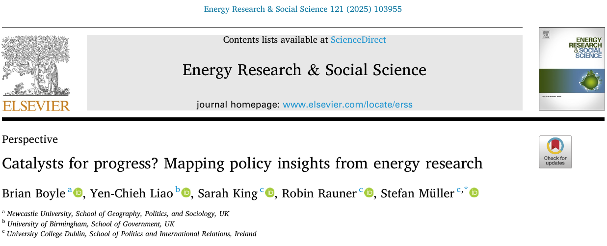{fig-alt="Title, journal, authors, and affiliations from Boyle et al. (2025), Catalysts for progress? Mapping policy insights from energy research, page 1."}
:::
::::
::::::
::: {.source}
Boyle, Liao, King, Rauner, and Müller (2025), Energy Research & Social Science 121: 103955, pp. 1-3. [DOI](https://doi.org/10.1016/j.erss.2025.103955). CC BY 4.0; cropped title excerpt.
:::

## From abstracts to a policy-relevance measure
:::::: {.slide-body}
- **Define:** presence or absence of a policy-relevant statement.
- **Develop:** 400 human-coded abstracts; seed terms and qualitative review.
- **Refine:** retain added terms that improve positive-class F1.
- **Evaluate:** 200 separate abstracts, not used for tuning.

Reported F1: **0.90 development / 0.86 held out**.

F1 combines precision and recall; we will calculate both later.

**Initial approach:** We first tried fine-tuning transformer models, but the results were not satisfactory.
::::::
::: {.source}
Boyle et al. (2025), Section 3, p. 3. [DOI](https://doi.org/10.1016/j.erss.2025.103955). Dictionary terms and additional metrics are in the article's SI Section C.
:::

## Policy relevance varies across journal groups
:::::: {.slide-body}
**About 15%** of abstracts were classified as policy relevant.

Only **8%** explicitly mentioned `policy` or `policies`.

| Journal aims and scope | Policy-relevant abstracts |
|---|---:|
| Explicitly refer to policy | 26.7% |
| Do not explicitly refer to policy | 3.7% |

These are descriptive text patterns, not evidence of policy uptake.
::::::
::: {.source}
Boyle et al. (2025), Sections 3-4, pp. 3-4; rounded published percentages. [DOI](https://doi.org/10.1016/j.erss.2025.103955).
:::

## A small example we can check by hand
:::::: {.slide-body}
| Text | Broad `bill*` | `energy bills` |
|---|---:|---:|
| Energy bills are rising. | 1 | 1 |
| This bill reforms parliament. | 1 | 0 |
| Families cannot afford heating. | 0 | 0 |

A phrase removes one false positive but still misses a relevant passage.
::::::
::: {.source}
Constructed teaching sentences; illustrative dictionary matches.
:::

## Matching with quanteda
:::::: {.slide-body}
**Predict:** Which sentence will the phrase dictionary match?

```r
# C07: A complete phrase-lookup example
library(quanteda)
examples <- c("Energy bills are rising.",
              "This bill reforms parliament.",
              "Families cannot afford heating.")
example_tokens <- tokens(examples, remove_punct = FALSE)
cost_dict <- dictionary(list(costs = "energy bills"))
matched <- tokens_lookup(example_tokens, cost_dict)
cost_counts <- dfm(matched)
as.matrix(cost_counts)
```

**Change:** Add `"cannot afford heating"`. Which error changes?
::::::
::: {.source}
[quanteda: multi-word expressions](https://quanteda.io/articles/pkgdown/phrase.html).
:::

## Exact terms and wildcard rules (1/2) {#exact-terms-and-wildcard-rules}
:::::: {.slide-body}
**Predict:** What will `bill*` retrieve besides bills?

```r
# C08: Wildcards in real speeches (run C01 first)
wild <- kwic(discovery_tokens, "bill*", window = 0)
exact <- kwic(discovery_tokens, c("bill", "bills"),
              valuetype = "fixed", window = 0)
c(wildcard = nrow(wild), exact = nrow(exact))
word_counts <- table(wild$keyword)
word_counts <- sort(word_counts, decreasing = TRUE)
head(word_counts, 8)
```

**Discuss:** Does an exact match solve the substantive ambiguity?
::::::
::: {.source}
quanteda pattern matching; W2 House of Commons sample.
:::

## Exact terms and wildcard rules (2/2) {#exact-wildcard-output}
:::::: {.slide-body}
:::: {.columns}
::: {.column}
**Actual C08 output**

```text
wildcard    exact
    1774     1539
```

- `bill*`: matches any suffix after `bill`, including `billion`.
- Exact `bill` / `bills`: 1,470 + 69 = **1,539 matches**.
- Exact matching still mixes **legislation and household bills**.
:::
::: {.column .caption}
**The eight most frequent wildcard matches**

| Token | Count | Token | Count |
|---|---:|---|---:|
| bill | 1,470 | billions | 18 |
| billion | 157 | billericay | 5 |
| bills | 69 | bill’s | 3 |
| bill's | 24 | billâ | 3 |

Different apostrophes and an apparent encoding artifact remain visible in the output.
:::
::::

**These are match counts, not numbers of speeches. Use KWIC to check meaning.**
::::::
::: {.source}
Executed C08 on the supplied discovery corpus with quanteda 4.3.1. Token spellings and counts preserved; exact matching uses valuetype = "fixed".
:::

## Phrase rules preserve useful context
:::::: {.slide-body}
:::: {.columns .evidence-columns}
::: {.column .evidence-copy}
- Phrases distinguish **energy bills** from legislative bills.
- Longer n-grams capture more local context.
- Specific expressions can also be **rare**.
- Match phrases before removing stopwords.
:::
::: {.column .evidence-image}
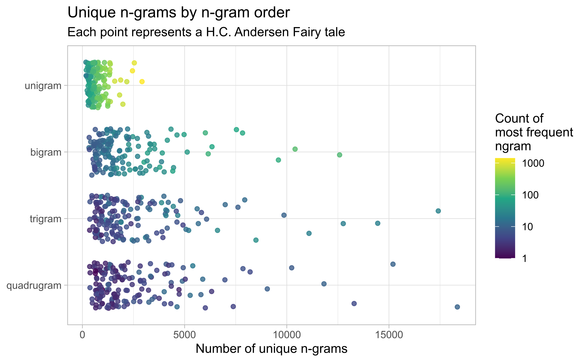{fig-alt="Hvitfeldt and Silge Figure 2.2: unique n-grams in Andersen stories, with color indicating the count of the most frequent n-gram on a logarithmic scale."}

::: {.caption}
**Note:** Each dot = one Andersen story at a given n-gram length. X = number of distinct n-grams; rows = 1–4-word sequences. Colour = occurrences of the most frequent n-gram (log scale: yellow = more; purple = fewer).
:::
:::
::::
::::::
::: {.source}
Hvitfeldt and Silge, online edition, [Figure 2.2](https://smltar.com/tokenization.html), CC BY-NC-SA 4.0. Political examples: course illustration.
:::

## Document length and the denominator (1/2) {#document-length-and-the-denominator}
:::::: {.slide-body}
**Predict:** Will counts and rates identify the same top speeches?

```r
# C09: Rankings on real speeches (run C01 first)
discovery_ids <- docnames(discovery_tokens)
rates <- subset(comparison, doc_id %in% discovery_ids)
rates <- subset(rates, tokens >= 50)
cols <- c("doc_id", "broad", "tokens", "broad_per100")
raw_order <- order(rates$broad, decreasing = TRUE)
rate_order <- order(rates$broad_per100, decreasing = TRUE)
head(rates[raw_order, cols], 3)
head(rates[rate_order, cols], 3)
```

**Compare:** What does the 50-token restriction change?
::::::
::: {.source}
W2 House of Commons sample; broad bill-prefix matches, not validated household hardship.
:::

## Document length and the denominator (2/2) {#count-rate-output}
:::::: {.slide-body}
`head(..., 3)` shows the top three rows; `cols` selects columns.

::: {.caption}
| Sorted by | doc_id | broad | tokens | broad_per100 |
|---|---|---:|---:|---:|
| Count | speech_2792 | 20 | 1,349 | 1.483 |
| Count | speech_1673 | 19 | 2,655 | 0.716 |
| Count | speech_0743 | 18 | 1,599 | 1.126 |
| Rate | speech_4435 | 4 | 69 | 5.797 |
| Rate | speech_1551 | 4 | 78 | 5.128 |
| Rate | speech_4917 | 3 | 59 | 5.085 |
:::

**Rate = 100 × broad / tokens.** `broad` counts matches to `bill*`.

20 / 1,349 → **1.48 per 100**; 4 / 69 → **5.80 per 100**.

**More matches does not necessarily mean a higher density.**
::::::
::: {.source}
Actual C09 output, rounded to three decimals; discovery texts with at least 50 tokens. Row names repeat doc_id and are omitted. Broad bill-prefix matches do not establish household hardship.
:::

## Case: measuring evaluations in German politics
:::::: {.slide-body}
:::: {.columns .evidence-columns}
::: {.column .evidence-copy}
- Can word counts recover **political evaluations**?
- Adapt existing German sentiment dictionaries.
- Compare their scores with human judgments.
- Test speeches, manifestos and news.
:::
::: {.column .evidence-image .paper-title}
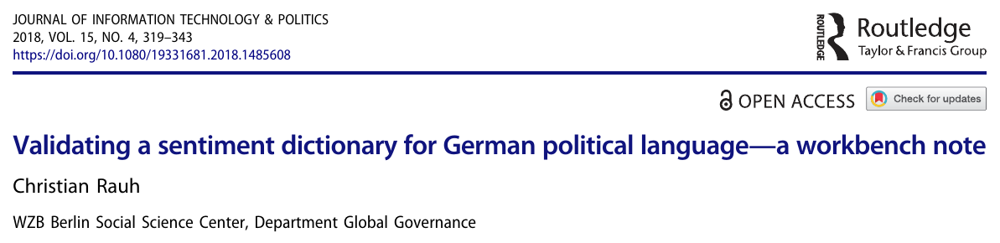{fig-alt="Original article-page excerpt: Rauh's title, Journal of Information Technology and Politics masthead, author, and WZB affiliation"}
:::
::::
::::::
::: {.source}
Rauh (2018), Journal of Information Technology & Politics 15(4): 319–343. [DOI](https://doi.org/10.1080/19331681.2018.1485608). Article-page excerpt, CC BY 4.0.
:::

## From political sentences to a validated score
:::::: {.slide-body}
<table>
<thead><tr><th>Step</th><th>What the study does</th></tr></thead>
<tbody>
<tr><td>Dictionary</td><td>Combine SentiWS and GermanPolarityClues; manually review terms</td></tr>
<tr class="fragment" data-fragment-index="0"><td>Context</td><td>Add direct two-word negation rules</td></tr>
<tr class="fragment" data-fragment-index="1"><td>Score</td><td>Positive minus negative matches, divided by retained terms</td></tr>
<tr class="fragment" data-fragment-index="2"><td>Validation</td><td>Three people code 1,500 sampled Bundestag sentences</td></tr>
</tbody>
</table>

Compare the original dictionaries and the augmented version with human judgments.
::::::
::: {.source}
Rauh (2018), Equation 1 and dictionary construction, pp. 320–323; human validation, pp. 325–327.
:::

## Case: sentiment and legislative agreement
:::::: {.slide-body}
:::: {.columns .evidence-columns}
::: {.column .evidence-copy}
- Does opposition language reflect **cross-party agreement**?
- Translate Lexicoder sentiment dictionaries.
- Validate scores against human judgments.
- Relate debate tone to unanimous bill passage.
:::
::: {.column .evidence-image .paper-title}
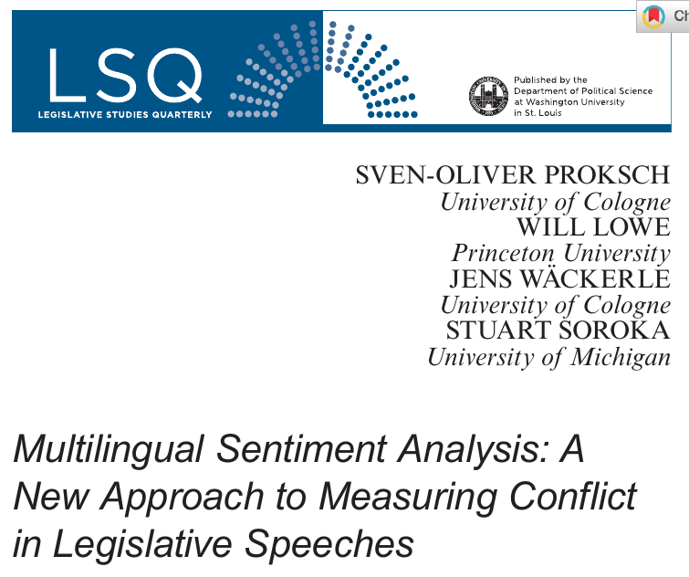{fig-alt="Original article-page excerpt: Proksch, Lowe, Wackerle and Soroka, their university affiliations, title, and Legislative Studies Quarterly masthead"}
:::
::::
::::::
::: {.source}
Proksch et al. (2019), Legislative Studies Quarterly 44(1): 97–131. [DOI](https://doi.org/10.1111/lsq.12218). Article-page excerpt.
:::

## From speeches to a test of cross-party agreement
:::::: {.slide-body}
**Question:** Is more positive opposition language associated with unanimous passage?

1. Collect about **26,000 speeches on 871 German government bills**, 2005-2017.
2. Match positive and negative words with translated Lexicoder dictionaries.
3. Aggregate counts by party and bill: `log((P + 0.5) / (N + 0.5))`.
4. Use bill-level sentiment in logistic regressions of unanimous passage.

Human-coded European Parliament texts provide a separate measurement check.
::::::
::: {.source}
Proksch et al. (2019), Equation 1, p. 102; validation, pp. 105–109; German application, pp. 118–121.
:::

## Two simple sentiment summaries
:::::: {.slide-body}
Let **P** = positive matches, **N** = negative matches, **L** = original token count.

| Summary | Definition | Interpretation |
|---|---|---|
| Net tone | 100 × (P − N) / L | Net matches per 100 tokens |
| Match coverage | 100 × (P + N) / L | Matched sentiment tokens per 100 tokens |

**Scoring means turning matches into a number.** With P = 3, N = 1 and L = 100: net tone = **2**, coverage = **4%**. These differ from Proksch et al.’s log-ratio score.
::::::
::: {.source}
Course lab definitions using single-token toy lexicons; contrast with Proksch et al. (2019).
:::

## Zero is not always neutral (1/2) {#zero-is-not-always-neutral}
:::::: {.slide-body}
::: {.caption}
`check_texts` contains five teaching examples, created in `workflow.R` and loaded by **C01**.

| Name | What it checks |
|---|---|
| `good` | A positive match |
| `negated` | Whether negation is handled |
| `unmatched` | No dictionary matches |
| `balanced` | Positive and negative matches cancel |
| `empty` | No words; denominator is zero |
:::

```r
# C10: Zero, balance and missing matches
check_texts
check_scores[, c("doc_id", "positive", "negative",
                 "net_per100", "coverage_per100", "balance")]
```

**Compare:** Why do `unmatched`, `balanced`, and `empty` differ?
::::::
::: {.source}
Rauh (2018), zero-biased scores; constructed teaching sentences and the lab's toy lexicon.
:::

## Zero is not always neutral (2/2) {#reading-check-scores}
:::::: {.slide-body}
::: {.caption}
P = positive matches; N = negative matches; L = total word tokens.
**Net** = 100 × (P − N) / L; **Coverage** = 100 × (P + N) / L; **Balance** = (P − N) / (P + N).
:::

:::: {.columns}
::: {.column .caption}
**Actual C10 output (rounded)**

| doc_id | Net | Coverage | Balance |
|---|---:|---:|---:|
| good | 25 | 25.00 | 1 |
| negated | 20 | 20.00 | 1 |
| unmatched | 0 | 0.00 | NA |
| balanced | 0 | 28.57 | 0 |
| empty | NA | NA | NA |

Net = `net_per100`; Coverage = `coverage_per100`; Balance = `balance`.
:::
::: {.column .caption}
**What each row means**

- **good:** 1 positive match / 4 words → 25 per 100; all matches positive.
- **negated:** 1 positive match / 5 words → 20. The rule ignores `not`.
- **unmatched:** text exists, but P = N = 0. Balance has a zero denominator.
- **balanced:** P = N = 1 across 7 words. Net = 0; coverage = 100 × 2 / 7 = 28.57%.
- **empty:** L = 0 and P + N = 0. All three scores are undefined (`NA`).
:::
::::

**Zero can mean no matches or cancellation; neither proves neutrality.**
::::::
::: {.source}
Constructed C10 examples from workflow.R. Balance ranges from −1 to 1 when P + N > 0. No real-text gold labels are implied.
:::

## Negation and dictionary matches (1/2) {#negation-changes-the-interpretation}
:::::: {.slide-body}
**Predict:** Will keeping `not` make the second sentence negative?

```r
# C11: A deliberate sentiment failure (run C01 first)
negation_tokens <- check_tokens[c("good", "negated")]
as.list(negation_tokens)
negation_dfm <- dfm(negation_tokens)
negation_counts <- dfm_lookup(negation_dfm, toy_sentiment)
as.matrix(negation_counts)
without_stopwords <- tokens_remove(negation_tokens, stopwords("en"))
as.list(without_stopwords)
```

**Explain:** Both sentences contain `good`. Does our word-count rule use `not` to change its category?
::::::
::: {.source}
Constructed teaching sentences and course code; context discussion in Rauh (2018).
:::

## Negation and dictionary matches (2/2) {#negation-output-explained}
:::::: {.slide-body}
:::: {.columns}
::: {.column}
**1. Dictionary matches**

```text
         positive negative
good            1        0
negated         1        0
```

Both sentences match `good`. The rule does not use `not` to reverse the match.
:::
::: {.column}
**2. After stopword removal**

```text
$good
[1] "policy" "good"

$negated
[1] "policy" "good"
```

`not` is deleted. The two token lists are now identical.
:::
::::

**Keep negation words, then add a rule that handles them.**
::::::
::: {.source}
Actual C11 output from the two teaching sentences. Keeping not alone does not make dictionary matching negation-aware.
:::

## A fixed negation window has limits
:::::: {.slide-body}
- “Not good” differs from “not only good but excellent.”
- “I reject the claim that this is a failure” contains negative words.
- Quoted criticism may not express the speaker's own view.
- Long-distance negation can exceed a simple word window.

Rules can improve a baseline without resolving every sentence.
::::::
::: {.source}
Illustrative sentences; Rauh (2018), discussion of contextual errors.
:::

## Preprocessing must fit the dictionary
:::::: {.slide-body}
:::: {.columns .evidence-columns}
::: {.column .evidence-copy}
- Stop-word lists remove **different shares** of a text.
- Keep negation when it carries meaning.
- Match dictionary entries to the chosen word forms.
- Check what each preprocessing choice discards.
:::
::: {.column .evidence-image}
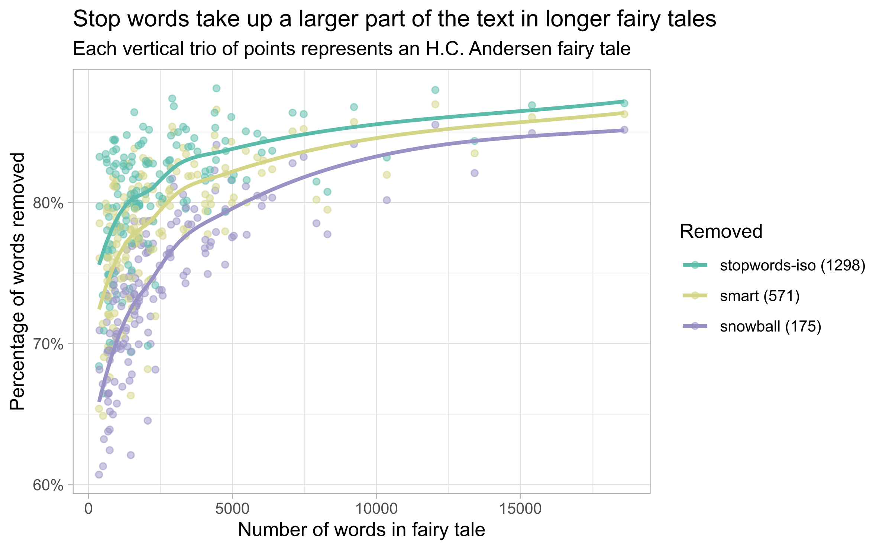{fig-alt="Hvitfeldt and Silge Figure 3.3: percentage of word tokens removed by three stop-word lists across Andersen stories of different lengths."}

::: {.caption}
**Note:** Each story has three points, one per stopword list. X = total words; Y = percentage of word occurrences removed. Colours identify lists; brackets show list sizes; curves show trends. Different lists remove different shares of the same text.
:::
:::
::::
::::::
::: {.source}
Hvitfeldt and Silge, [Figure 3.3](https://smltar.com/stopwords.html), CC BY-NC-SA 4.0. Connection: Text as Data, Ch. 5.4-5.6; Denny and Spirling (2018).
:::

## Case: locating parties from their manifestos
:::::: {.slide-body}
:::: {.columns .evidence-columns}
::: {.column .evidence-copy}
- Can manifesto language locate parties on a **left-right scale**?
- Eight British manifestos, 1983-1997.
- Wordfish estimates positions from word counts.
- Do preprocessing choices change the ordering?
:::
::: {.column .evidence-image .paper-title}
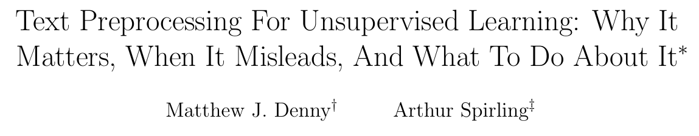{fig-alt="Denny and Spirling author manuscript title and authors"}
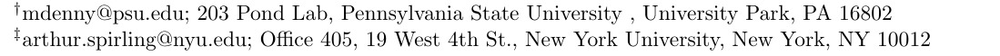{fig-alt="Author manuscript affiliations: Pennsylvania State University and New York University"}
:::
::::
::::::
::: {.source}
Denny and Spirling (2018), Political Analysis 26(2): 168–189. [DOI](https://doi.org/10.1017/pan.2017.44). Images: author manuscript dated September 27, 2017.
:::

## 12 orderings from the same manifestos
:::::: {.slide-body}
:::: {.columns .evidence-columns}
::: {.column .evidence-copy}
- Same eight manifestos and Wordfish model.
- **128** preprocessing specifications.
- **12 distinct orderings** of the documents.
- Black cells disagree with the authors' prior ordering.
:::
::: {.column .evidence-image .tall-figure}
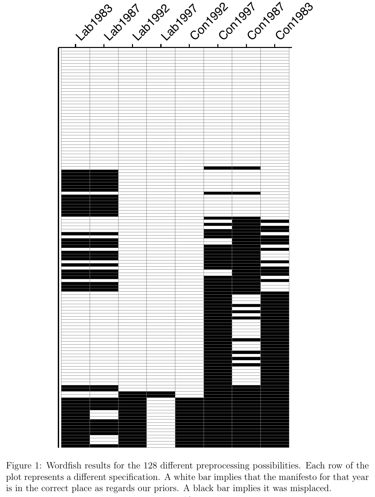{fig-alt="Denny and Spirling Figure 1: 128 preprocessing specifications and manifesto placements"}
:::
::::
::::::
::: {.source}
Denny and Spirling (2018), author manuscript Figure 1, p. 18. White cells agree with the stated prior ordering.
:::

## What the manifesto case can establish
:::::: {.slide-body}
| Research claim | What this case shows |
|---|---|
| Vocabulary can place parties on a scale | Wordfish estimates relative positions from counts |
| The ordering survives reasonable choices | Check it: this example produces 12 orderings |
| The model explains why a party changed | That causal question needs a different design |

For our dictionaries: do substantive comparisons survive reasonable scoring choices?
::::::
::: {.source}
Denny and Spirling (2018), author manuscript Section 5.1, pp. 15–18. Dictionary comparison is a course extension.
:::

## Your case: does a dictionary revision improve measurement?
:::::: {.slide-body}
**Predict:** Which version will flag more speeches?

```r
# C12: Dictionary revisions (run C01 first)
policy_entries[, c("version", "category", "pattern")]
dev <- subset(policy_scores,
  doc_id %in% docnames(discovery_tokens))
c(v1 = sum(dev$v1 > 0), v2 = sum(dev$v2 > 0))
energy_context <- kwic(discovery_tokens, "energy", window = 5)
head(energy_context, 3)
```

**Discuss:** Scores changed. Do they agree better with human judgments?
::::::
::: {.source}
Here we switch from sentiment to energy-policy mentions. Sensitivity principle: Denny and Spirling (2018).
:::

## Sentiment scores against human judgments
:::::: {.slide-body}
**Return to Rauh: do dictionary scores recover human-rated evaluations?**

:::: {.columns .evidence-columns}
::: {.column .evidence-copy}
- **1,500 Bundestag sentences**, three coders.
- Compare three dictionaries across human-rated categories.
- Positive categories separate more clearly.
- Intervals show uncertainty in **group means**, not classification accuracy.
:::
::: {.column .evidence-image .paper-figure}
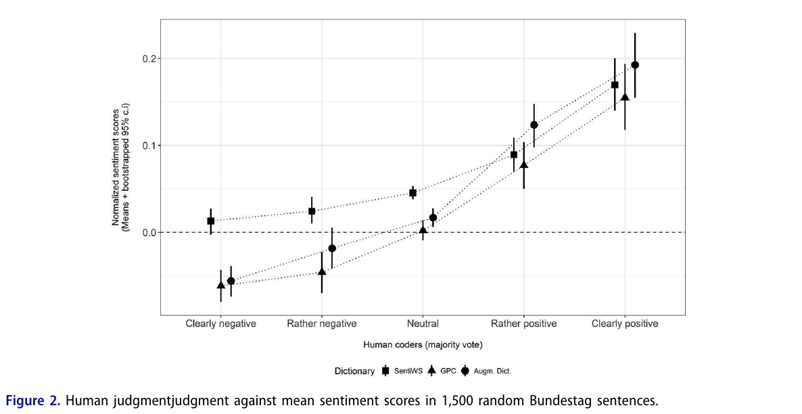{fig-alt="Rauh Figure 2: three dictionary scores across human-coded sentiment categories, with 95 percent intervals"}
:::
::::
::::::
::: {.source}
Rauh (2018), Figure 2, p. 327; n = 1,500 Bundestag sentences. Reproduced excerpt, CC BY 4.0.
:::

## Positive evaluations are easier to recover
:::::: {.slide-body}
- **Result:** positive evaluations separate more clearly than negative ones.
- **Use:** a tested indicator for comparing evaluative language in political texts.
- **Limit:** scores cluster near zero and do not have self-evident numerical units.

The study validates a measure. It does not explain why politicians become more positive.
::::::
::: {.source}
Rauh (2018), results and conclusion.
:::

## Human and automated scores by speaker group
:::::: {.slide-body}
**Return to Proksch et al.: compare human and automated group-level tone.**

:::: {.columns .evidence-columns}
::: {.column .evidence-copy}
- **300 paragraphs**, two human ratings per paragraph.
- Compare standardized scores by speaker group.
- Reported group-level correlation: **about 0.9**.
- This is not 90% classification accuracy.
:::
::: {.column .evidence-image .paper-figure}
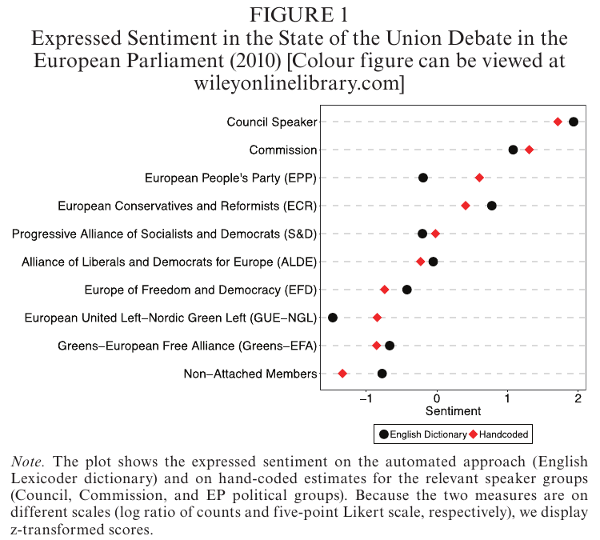{fig-alt="Proksch et al. Figure 1: automated and hand-coded sentiment by European Parliament speaker group"}
:::
::::
::::::
::: {.source}
Proksch et al. (2019), Figure 1, p. 109. Black circles: English dictionary; red diamonds: hand-coded scores.
:::

## Validation depends on the level of the claim
:::::: {.slide-body}
| Claim | Evidence needed |
|---|---|
| This sentence is negative | Sentence-level agreement |
| This group is relatively more positive | Group-level measurement validity |
| Sentiment changed over time | Stable measurement across periods |
| Countries differ in conflict | Comparable measures and institutional context |

One successful comparison does not validate every use.
::::::
::: {.source}
Interpretive implications of Proksch et al. (2019) and Rauh (2018).
:::

## Translation is a measurement decision
:::::: {.slide-body}
- A translated term can have a different political use.
- Translation may produce several possible equivalents.
- Morphology and tokenization affect matches.
- Validate languages separately and examine difficult cases.

Shared category names do not guarantee comparable numerical scales.
::::::
::: {.source}
Proksch et al. (2019), multilingual dictionary validation.
:::

## Does opposition tone reflect agreement?
:::::: {.slide-body}
:::: {.columns .evidence-columns}
::: {.column .evidence-copy}
- Outcome: **unanimous bill passage**.
- **814 bills** in the regressions.
- Positive coefficients in all three models; only model (3) is significant.
- Association, not a causal effect of tone.
:::
::: {.column .evidence-image .paper-figure}
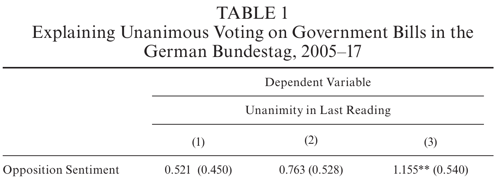{fig-alt="Proksch et al. Table 1 excerpt: the opposition-sentiment coefficients in three logistic regressions of unanimous passage of German government bills"}
:::
::::
::::::
::: {.source}
Proksch et al. (2019), Table 1 excerpt, p. 120. Other rows omitted; ** p < .05. Standard errors in parentheses.
:::

## Sentiment, stance, and conflict
:::::: {.slide-body}
| Concept | What the evidence must establish |
|---|---|
| Sentiment | Evaluative language in a defined unit |
| Stance | Support or opposition toward a specified target |
| Conflict | A substantive relationship between actors or positions |

Negative words can describe a social problem without attacking another party.
::::::
::: {.source}
Discussion of the measurement argument in Proksch et al. (2019); illustrative distinction.
:::

## A human benchmark
:::::: {.slide-body}
- Write a codebook with positive, negative, and ambiguous examples.
- Keep coders unaware of dictionary predictions when practical.
- Record disagreement and the adjudication procedure.
- Match the coding unit to the intended use of the score.

Human labels are evidence to scrutinize, not unquestionable truth.
::::::
::: {.source}
Rauh (2018); Proksch et al. (2019); W6 preview.
:::

## Which texts should we validate?
:::::: {.slide-body}
- Include matched **and unmatched** passages.
- Cover important dates, groups, and document lengths.
- Use an untouched sample for final performance estimates.
- Inspect rare or ambiguous cases separately for diagnosis.

A collection of easy examples cannot establish corpus-wide performance.
::::::
::: {.source}
Course validation guidelines; validation designs in the assigned articles.
:::

## Inter-coder reliability: do humans agree?
:::::: {.slide-body}
:::: {.columns .evidence-columns}
::: {.column .evidence-copy}
- Code the same texts **independently** before discussing differences.
- Rauh: **3 coders**, 1,500 sentences.
- **59.1%** full agreement; ordinal alpha **.675**.
- Agreement does not establish **validity**.
:::
::: {.column .evidence-image .paper-figure}
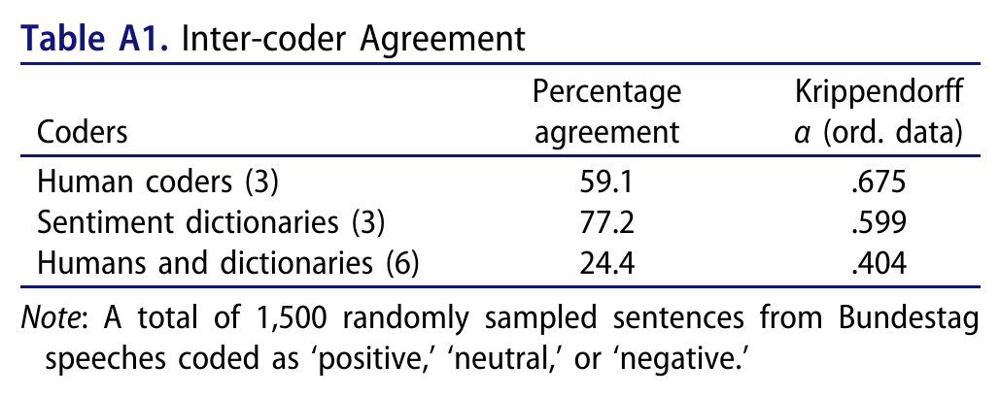{fig-alt="Rauh Table A1: human coders, dictionaries and their combined agreement; three human coders agree fully on 59.1 percent of 1500 sentences, ordinal Krippendorff alpha .675"}
:::
::::
::::::
::: {.source}
Rauh (2018), Table A1, p. 340; coding design pp. 325-326. Unchanged table excerpt, CC BY 4.0.
:::

## Agreement in R: two human coders
:::::: {.slide-body}
**Extension:** ten illustrative labels, 1 = energy-policy relevant, 0 = not relevant.

```r
# C13: Human agreement, not model accuracy
# install.packages("irr")  # run once
library(irr)
ratings <- data.frame(
  coder_A = c(1, 1, 1, 1, 1, 0, 0, 0, 0, 0),
  coder_B = c(1, 1, 1, 1, 0, 1, 0, 0, 0, 0))
table(ratings$coder_A, ratings$coder_B)
mean(ratings$coder_A == ratings$coder_B)
agreement <- kappa2(ratings, weight = "unweighted")
agreement$value
```

**Discuss:** What does kappa (.60) tell us beyond raw agreement (80%)?
::::::
::: {.source}
Constructed labels, not Rauh's data or annotations of our corpus. [irr package documentation](https://cran.r-universe.dev/irr/doc/manual.html); W6 preview.
:::

## A confusion matrix for issue detection
:::::: {.slide-body}
| 20 illustrative passages | Human: relevant | Human: not relevant |
|---|---:|---:|
| Dictionary: match | 6 true positives | 2 false positives |
| Dictionary: no match | 4 false negatives | 8 true negatives |

The unit is a **passage**, not a dictionary word.
::::::
::: {.source}
Illustrative counts for classroom practice; not empirical results from the lab corpus.
:::

## Precision and recall answer different questions (1/2) {#precision-and-recall-answer-different-questions}
:::::: {.slide-body}
**Before running the code:** calculate precision and recall from the preceding table.

```r
# C14: Checking validation arithmetic (run C01 first)
predicted <- validation$predicted
human <- validation$human
TP <- sum(predicted == 1 & human == 1)
FP <- sum(predicted == 1 & human == 0)
FN <- sum(predicted == 0 & human == 1)
precision <- TP / (TP + FP)
recall <- TP / (TP + FN)
F1 <- 2 * TP / (2 * TP + FP + FN)
c(precision = precision, recall = recall, F1 = F1)
```

**Discuss:** Could we estimate recall by reading only dictionary matches?
::::::
::: {.source}
C14 uses 20 illustrative passages. The take-home lab uses a different set of 12 test sentences, so its results differ.
:::

## Precision and recall answer different questions (2/2) {#precision-and-recall-results}
:::::: {.slide-body}
**Code:** `c(precision = precision, recall = recall, F1 = F1)`

```text
precision    recall        F1
0.7500000 0.6000000 0.6666667
```

- **Precision = 0.75:** Of 8 passages the dictionary flags, **6 are relevant** (6 / 8).
- **Recall = 0.60:** Of 10 relevant passages, the dictionary **finds 6** (6 / 10).
- **F1 ≈ 0.667:** Combines precision and recall: 2 × 6 / (2 × 6 + 2 + 4).

**Missed cases matter:** reading only matched passages cannot tell us recall.
::::::
::: {.source}
C14 output from 20 illustrative passages: TP = 6, FP = 2, FN = 4, TN = 8. F1 is not accuracy.
:::

## Evaluating continuous sentiment scores
:::::: {.slide-body}
- Plot scores against human ratings.
- Inspect group means **and** individual disagreements.
- Check unmatched texts, compressed ranges, and extreme values.
- Compare performance across groups and genres.

Two scores can rise together but still disagree: scores of 1, 2, 3 and 11, 12, 13 have perfect correlation.
::::::
::: {.source}
Rauh (2018), Figures 1–3; Proksch et al. (2019), Figure 1.
:::

## Dictionary sensitivity (1/2) {#a-compact-sensitivity-analysis}
:::::: {.slide-body}
**What is `dev`?** The table created in **C12** for inspecting dictionary rules: **one row = one speech**, with 4,950 speeches.

`v1_per1000` and `v2_per1000` are its columns: matches per 1,000 words under each dictionary version.

```r
# C15: Visualizing dictionary sensitivity (run C12 first)
# install.packages("ggplot2")  # run once
library(ggplot2)
ggplot(dev, aes(x = v1_per1000, y = v2_per1000)) +
  geom_point(size = 1, alpha = 0.4, colour = "#314f4f") +
  geom_abline(intercept = 0, slope = 1,
              colour = "firebrick", linetype = "dashed") +
  labs(x = "v1 matches per 1,000 tokens",
       y = "v2 matches per 1,000 tokens") +
  theme_minimal()
```

**Discuss:** What can this plot show without human labels?
::::::
::: {.source}
Denny and Spirling (2018), sensitivity principle; W4 dictionaries and W2 speech sample. This is a classroom analysis, not the paper's figure.
:::

## Dictionary sensitivity (2/2) {#reading-the-sensitivity-plot}
:::::: {.slide-body .sensitivity-figure}
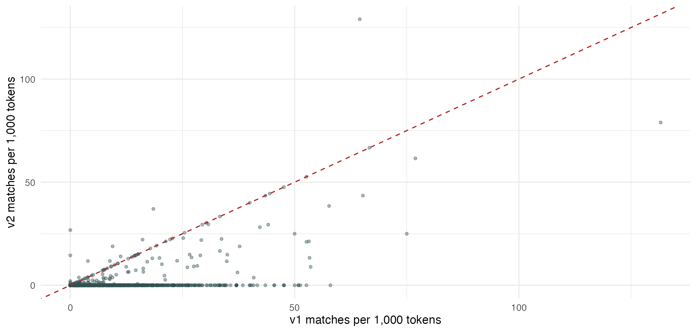{fig-alt="Scatter plot of dictionary v1 versus v2 matches per 1,000 tokens for discovery speeches. The red dashed line marks equal scores."}

::: {.caption}
**One point = one speech.** On the dashed line: unchanged; below: fewer matches in v2; above: more matches in v2. Overlapping points can hide many speeches.

**Changed scores show sensitivity, not which dictionary is more valid.**
:::
::::::
::: {.source}
Actual C15 output using dev from C12; supplied House of Commons sample. Human labels are needed to assess validity.
:::

## What a methods section should report
:::::: {.slide-body}
- Corpus boundaries, source, and unit of analysis.
- Dictionary origin, version, language, and modifications.
- Matching, preprocessing, denominator, and zero rules.
- Human validation design, results, and remaining errors.
- Code and access information sufficient to audit the workflow.
::::::
::: {.source}
Course synthesis of the assigned readings.
:::

## Embeddings and LLMs can propose candidates
:::::: {.slide-body}
Seed concept → suggested terms → corpus examples → researcher review

- Embeddings can suggest related expressions.
- LLMs can propose variants or organize candidate lists.
- Antonyms and irrelevant associations can also appear.
- Keep an independent human benchmark.

These tools assist dictionary development; they do not certify validity.
::::::
::: {.source}
Course extension: candidate expansion; embeddings in W9, LLMs in W12.
:::

## Extending the workflow to Chinese texts
:::::: {.slide-body}
| Choice | Example issue |
|---|---|
| Segmentation | Does a relevant expression remain intact? |
| Script normalization | Are variants merged appropriately? |
| Entity aliases | Are abbreviations linked to the correct institution? |
| Negation and context | Does the phrase express support, criticism, or quotation? |

Validate in the language and political setting of the project.
::::::
::: {.source}
Course extension of the multilingual measurement issues in Proksch et al. (2019).
:::

## Applying the ideas to a research project
:::::: {.slide-body}
Choose one possible corpus and complete these sentences:

- I want to measure **...**, rather than merely count **...**.
- My unit of analysis is **...**.
- A plausible false positive is **...**.
- A plausible false negative is **...**.
- I would validate the measure using **...**.
::::::

## LIWC: what does it measure?
:::::: {.slide-body}
**Application: use the same construction, scoring and validation principles.**

**LIWC = Linguistic Inquiry and Word Count.**

- Matches language to predefined dictionary categories.
- Categories include pronouns, emotion and social processes.
- Most category scores are percentages of a text's words.

**Example:** 4 category matches in 100 words = **4%**.

A category percentage measures word use; interpretation needs validation.
::::::
::: {.source}
[LIWC: How It Works](https://liwc.app/help/howitworks); [LIWC Analysis](https://liwc.app/help/liwc). Percentage calculation is a constructed teaching example.
:::

## LIWC and quanteda: separate roles
:::::: {.slide-body}
| Resource | Role | Access |
|---|---|---|
| LIWC application | Runs built-in or custom dictionaries | Licensed software |
| Official LIWC dictionaries | Proprietary word-category resources | Subject to license |
| quanteda + our dictionary | R matching with our own rules | No LIWC purchase |

**Importing a file does not grant a license to use its dictionary.**
::::::
::: {.source}
[LIWC license](https://liwc.app/help/eula); [Dictionary Workbench](https://liwc.app/help/workbench); [quanteda import](https://quanteda.io/reference/dictionary.html).
:::

## Campaign statements: vague or concrete? {#eichorst-lin-case}
:::::: {.slide-body}
:::: {.columns .evidence-columns}
::: {.column .evidence-copy}
- **Eichorst & Lin (2019)**
- When do parties make concrete campaign statements?
- Texts: English-language party programs.
- Compare government status and economic performance.
:::
::: {.column .evidence-image .paper-title}
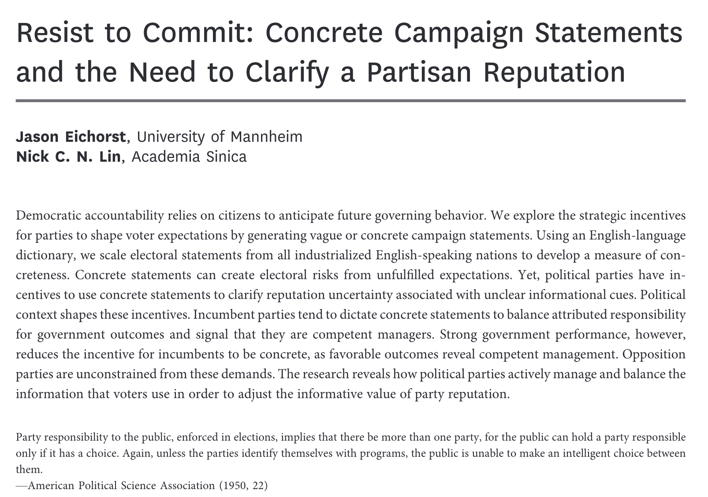{fig-alt="User-supplied article title and abstract: Resist to Commit, Jason Eichorst and Nick C. N. Lin"}
:::
::::
::::::
::: {.source}
Eichorst & Lin (2019), Resist to Commit. [Article](https://doi.org/10.1086/700002). Supplementary application; supplied excerpt.
:::

## Reading the word-density figure {#eichorst-lin-density}
:::::: {.slide-body}
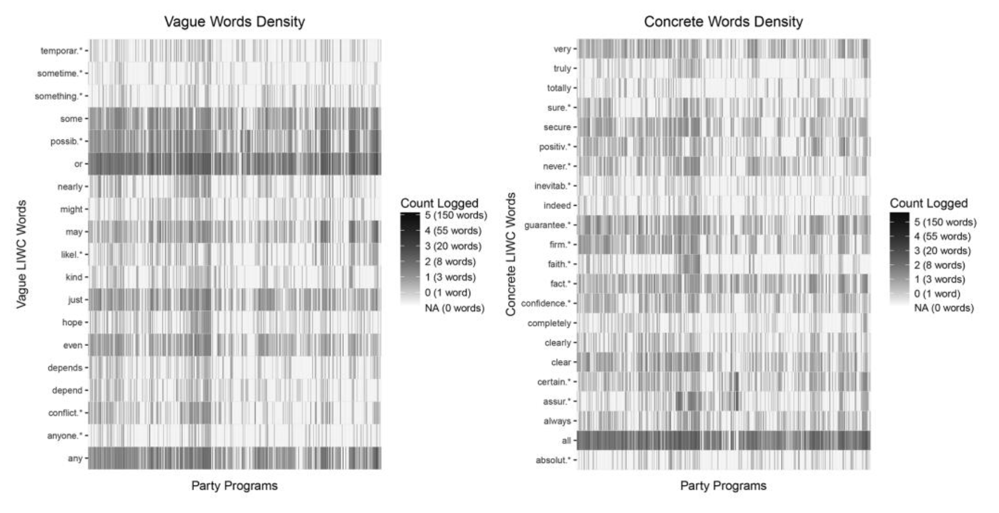{fig-alt="Two panels showing vague and concrete word counts across party programs, using a logged grayscale legend"}

Each column is a **party program**; each row is a **dictionary term**.
Darker cells indicate larger logged counts; white indicates zero.
::::::
::: {.source}
Eichorst & Lin (2019), Figure 1. [Article](https://doi.org/10.1086/700002). User-supplied figure excerpt; counts, not normalized rates.
:::

## A two-sentence dictionary example (1/3) {#campaign-simple-code}
:::::: {.slide-body}
**Copy the whole block into R.** Requires `quanteda`.

```r
library(quanteda)
text <- c("We may improve public services.",
          "We guarantee better public services.")
dict <- dictionary(list(vague = "may", concrete = "guarantee"))
toks <- tokens(text, remove_punct = TRUE)
counts <- dfm(toks)
hits <- dfm_lookup(counts, dictionary = dict)
as.matrix(hits)
```
::::::
::: {.source}
Constructed sentences and a two-word teaching dictionary. Run in local R; this is not the paper's code or full LIWC dictionary.
:::

## A two-sentence dictionary example (2/3) {#campaign-simple-output}
:::::: {.slide-body}
```text
       features
docs    vague concrete
  text1     1        0
  text2     0        1
```

- `text1`: **may** matches the vague category once.
- `text2`: **guarantee** matches the concrete category once.
- The values count words matched by our rules.

**Try:** Add `not` before `guarantee`. Will the count change?
::::::
::: {.source}
Actual output of the preceding constructed example. No political finding is estimated here.
:::

## A two-sentence dictionary example (3/3) {#campaign-simple-score}
:::::: {.slide-body}
**Teaching score = 100 × (C − V) / L**

C = concrete matches; V = vague matches; L = all word tokens.

This is **concrete percentage − vague percentage**, in percentage points.

```r
m <- as.matrix(hits)
100 * (m[, "concrete"] - m[, "vague"]) / ntoken(toks)
# text1 text2
#   -20    20
```

text1: 100 × (0 − 1) / 5 = **−20**; text2: 100 × (1 − 0) / 5 = **20**.

**Adapted from Eichorst & Lin (2019):** the paper excludes stopwords from the denominator and rescales the difference to 0–1. Our example does neither.
::::::
::: {.source}
Eichorst & Lin (2019), “Dependent variable: Manifesto concreteness,” footnote 16. Simplified teaching formula and dictionary, not a replication. [Article](https://doi.org/10.1086/700002).
:::

## LIWC in sport and exercise
:::::: {.slide-body}
:::: {.columns .evidence-columns}
::: {.column .evidence-copy}
- **Lin (2023):** a Chinese-language review.
- Explains dictionary categories and word-use rates.
- Reviews research on injury, self-efficacy and sport communication.
- **Discussion:** What would language reveal about a team?
:::
::: {.column .evidence-image .paper-title}
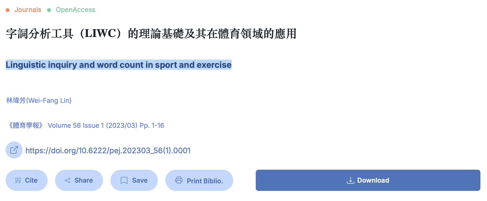{fig-alt="User-supplied article record: Wei-Fang Lin, Linguistic inquiry and word count in sport and exercise, Physical Education Journal 56(1), 2023, pages 1-16, with Chinese title and DOI"}
:::
::::
::::::
::: {.source}
Lin (2023), Physical Education Journal 56(1): 1-16. [Article](https://doi.org/10.6222/pej.202303_56%281%29.0001). Supplementary review; supplied title screenshot.
:::

## Chinese LIWC: a validation case
:::::: {.slide-body}
:::: {.columns .evidence-columns}
::: {.column .evidence-copy}
- **Question:** Do categories distinguish emotional contexts?
- **Data:** 50 Hate + 50 Sad posts from PTT.
- **Anger words:** 2.00% vs. 0.88%; Cohen's d = 0.61.
- Group differences are **not individual diagnoses**.
:::
::: {.column .evidence-image .paper-figure}
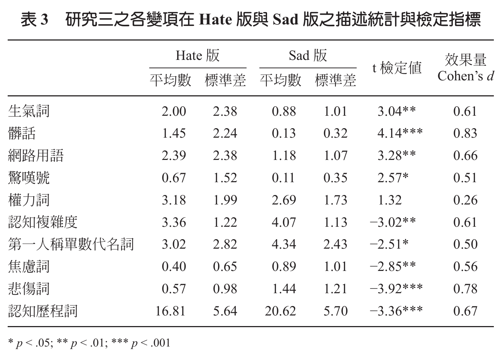{fig-alt="Complete Table 3 from Lin et al. 2020, page 105: ten linguistic measures for PTT Hate and Sad posts, means, standard deviations, t statistics, Cohen's d and significance legend"}
:::
::::
::::::
::: {.source}
Lin et al. (2020), Study 3, Table 3, p. 105; n = 100 posts. [Paper and full text](https://www.rchss.sinica.edu.tw/srma/journals/3561). Original table excerpt.
:::

## Our dictionary, applied with quanteda {#liwc-format-and-custom-categories}
:::::: {.slide-body}
Import our **ten-word teaching dictionary**, not an official LIWC dictionary.

```r
# C16: Custom dictionary (run C01; stay in W4/classroom)
library(quanteda)
own <- dictionary(file = "Dictionaries/teaching_affect.dic", format = "LIWC")
mini <- tokens(c("Good policy.", "A bad crisis."), remove_punct = TRUE)
matched <- tokens_lookup(mini, own, capkeys = FALSE)
hits <- dfm(matched)
counts <- as.matrix(hits)
counts
word_count <- ntoken(mini)
100 * counts / word_count
```

**Discuss:** Why divide by all word tokens, not just dictionary matches?
::::::
::: {.source}
Original course dictionary and constructed sentences. [quanteda import](https://quanteda.io/reference/dictionary.html); not official LIWC output.
:::

## Custom policy dictionary: inspect the errors
:::::: {.slide-body}
**Optional challenge:** Add one justified energy-policy expression.

```r
# O02: Your own dictionary (run C01 first)
my_dict <- dictionary(list(energy = c("energy", "gas bills")))
matched <- tokens_lookup(discovery_tokens, my_dict)
my_dfm <- dfm(matched)
my_counts <- as.numeric(my_dfm[, "energy"])
sum(my_counts > 0)
my_context <- kwic(discovery_tokens, "energy", window = 6)
head(my_context, 3)
```

**In pairs:** Show one supporting passage and one possible false positive.
::::::
::: {.source}
W4 core tasks 2-3; W2 tokens, KWIC and metadata.
:::

## Validation: freeze, test and interpret
:::::: {.slide-body}
- **Develop:** use 12 teaching sentences to see what v1 and v2 get wrong.
- **Freeze:** keep the supplied v2 unchanged for the next 12 sentences.
- **Test:** compare its predictions with the supplied labels, including nonmatches.
- **Result:** precision **0.80**, recall **0.667**, F1 **0.727**.

Illustrative arithmetic, not estimated performance on Parliament.
::::::
::: {.source}
W4 synthetic examples and worked answers; real-text validation is still to be completed.
:::

## Dictionaries: strengths and limitations {#where-do-dictionaries-help-and-fail}
:::::: {.slide-body}
**Would a dictionary be a good choice for your project?**

- Identify **two strengths** and **two limitations**.
- How would you balance speed, transparency, and sensitivity to context?
- What validation evidence would support your choice?

**Discuss in pairs for 2 minutes:** choose a corpus and explain your decision.
::::::
::: {.source}
Closing discussion: Denny and Spirling (2018), Rauh (2018), and Proksch et al. (2019).
:::

## Five sentences, three annotation methods {#five-sentences-three-methods}
:::::: {.slide-body}
**First, label the sentiment expressed in each sentence.**

:::: {.columns}
::: {.column}
1. This policy is good.
2. This policy is bad.
3. This policy is not good.
4. Excellent, another tax increase.
5. The committee met on Tuesday.
:::
::: {.column}
| Method | How it assigns labels |
|---|---|
| Dictionary lookup | Matches words to predefined categories. |
| Transformer classifier | Predicts labels using a trained model. |
| LLM prompting | Follows a prompt and coding instructions. |
:::
::::

**Which sentences need more than word matching?**
::::::
::: {.source}
Original classroom examples. [Run dictionary example](../classroom/examples/five_sentence_sentiment.R).
:::

## Comparing time for the same five sentences {#five-sentences-a-speed-simulation}
:::::: {.slide-body}
**A hypothetical timing comparison, not a benchmark.**

:::: {.columns}
::: {.column}
1. This policy is good.
2. This policy is bad.
3. This policy is not good.
4. Excellent, another tax increase.
5. The committee met on Tuesday.
:::
::: {.column}
| Method | Time for all five |
|---|---|
| Dictionary lookup | **0.02 seconds** |
| Transformer classifier | **0.30 seconds** |
| LLM prompting | **3.00 seconds** |
:::
::::

**Would faster labels answer our research question? What validation is still needed?**
::::::
::: {.source}
Illustrative timings, not measurements. [Run dictionary example](../classroom/examples/five_sentence_sentiment.R). [Inference and batching](https://huggingface.co/docs/transformers/en/main_classes/pipelines#pipeline-batching).
:::

## Before W6: five texts and one difficult decision
:::::: {.slide-body}
**W5 (October 9): no class. W6 (October 16): human coding and classification.**

| Prepare now | Develop in W6 |
|---|---|
| Label five texts with a short codebook | Annotation quality and coder agreement |
| Explain one uncertain decision | Refine definitions before training |
| Keep dictionary predictions separate | Train and evaluate Naive Bayes / SVM |

About 10 minutes of preparation; no model training or upload.
::::::
::: {.source}
Course syllabus, W5-W6; W4 development-text warm-up.
:::


## Take-home lab: custom dictionaries
:::::: {.slide-body}
**45-60 minutes of core practice.**

1. Read the teaching dictionary and calculate sentiment scores.
2. Change an energy-policy rule and inspect its matches.
3. Find false matches and missed cases in development examples.
4. Keep v2 fixed and calculate precision, recall and F1 on test examples.

Lab materials will be released separately.
::::::
::: {.source}
Course lab: custom dictionaries, context checks and validation using the W2 corpus.
:::

## Three assigned articles
:::::: {.slide-body .reference-list}
**Denny, M. J., and A. Spirling (2018).** “Text Preprocessing for Unsupervised Learning: Why It Matters, When It Misleads, and What to Do about It.” *Political Analysis* 26(2): 168–189. [DOI](https://doi.org/10.1017/pan.2017.44)

**Rauh, C. (2018).** “Validating a Sentiment Dictionary for German Political Language: A Workbench Note.” *Journal of Information Technology & Politics* 15(4): 319–343. [DOI](https://doi.org/10.1080/19331681.2018.1485608)

**Proksch, S.-O., W. Lowe, J. Wäckerle, and S. Soroka (2019).** “Multilingual Sentiment Analysis: A New Approach to Measuring Conflict in Legislative Speeches.” *Legislative Studies Quarterly* 44(1): 97–131. [DOI](https://doi.org/10.1111/lsq.12218)
::::::
::: {.source}
Technical resources: quanteda, udpipe and Flair documentation. Selected activities and the W2 corpus draw on ESS materials by Schoonvelde (2026), acknowledging Stefan Müller; this deck also includes course-designed examples and code.
:::

## Readings and software references
:::::: {.slide-body .reference-list}
::::: {.columns}
:::: {.column}
**Further readings**

**Grimmer, Roberts & Stewart (2022).** [*Text as Data*](https://bstewart.scholar.princeton.edu/publications/text-data-new-framework-machine-learning-and-social-sciences). Chapters 5 and 16.

**Hvitfeldt & Silge.** [*Supervised Machine Learning for Text Analysis in R*](https://smltar.com/). Online chapters on tokenization and stopwords.

**Eichorst & Lin (2019).** [“Resist to Commit.”](https://doi.org/10.1086/700002) *The Journal of Politics* 81(1): 15–32.

**Boyle et al. (2025).** [“Catalysts for progress? Mapping policy insights from energy research.”](https://doi.org/10.1016/j.erss.2025.103955) *Energy Research & Social Science* 121: 103955.
::::
:::: {.column}
**Software documentation**

**quanteda:** [dictionaries](https://quanteda.io/reference/dictionary.html), [KWIC](https://quanteda.io/reference/kwic.html) and text matching.

**[quanteda.textstats](https://cran.r-project.org/package=quanteda.textstats):** frequency, collocations and keyness.

**[UDPipe](https://bnosac.github.io/udpipe/docs/doc1.html) / [TextRank](https://cran.r-project.org/package=textrank):** annotation and [keyword extraction](https://bnosac.github.io/udpipe/docs/doc7.html).

**[ggplot2](https://ggplot2.tidyverse.org/reference/):** plotting dictionary scores.

**[Flair](https://flairnlp.github.io/flair/master/tutorial/tutorial-basics/tagging-entities.html):** named entity recognition (Python).

**[irr](https://cran.r-universe.dev/irr/doc/manual.html):** agreement between coders.

**[LIWC](https://liwc.app/help/howitworks):** categories and word-use measures.
::::
:::::
::::::
::: {.source}
The three assigned articles are on the previous slide. Additional citations: [supplementary.bib](../references/supplementary.bib). Classroom examples include original teaching materials.
:::
