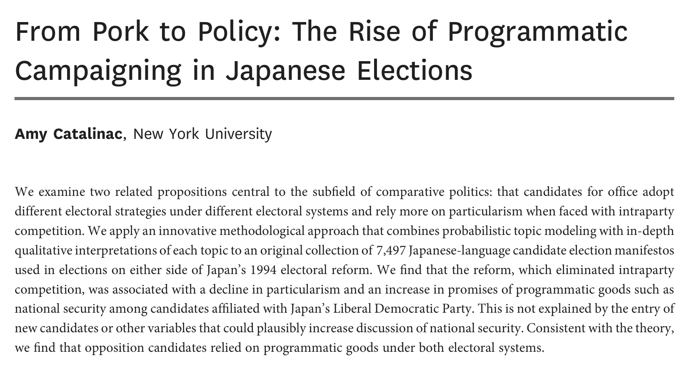
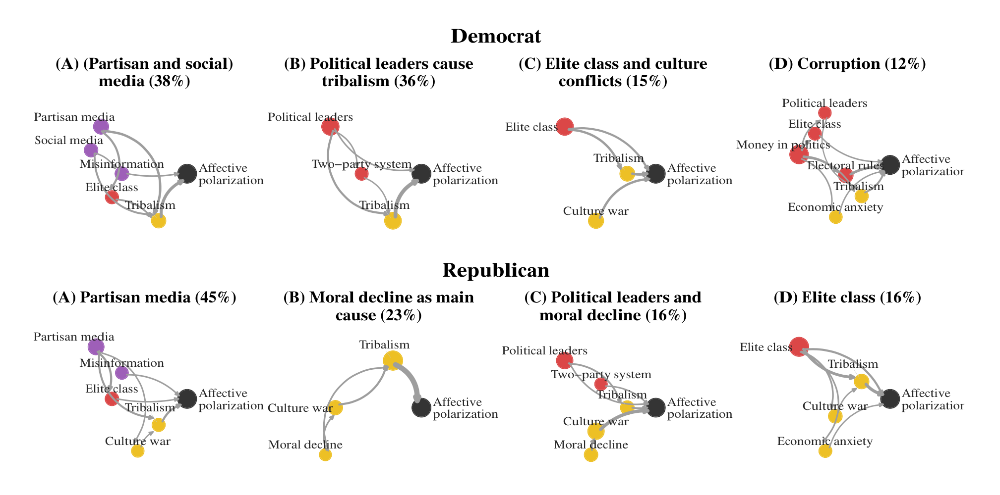
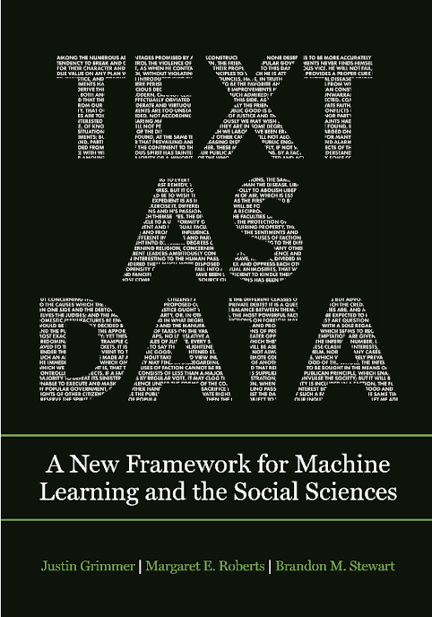
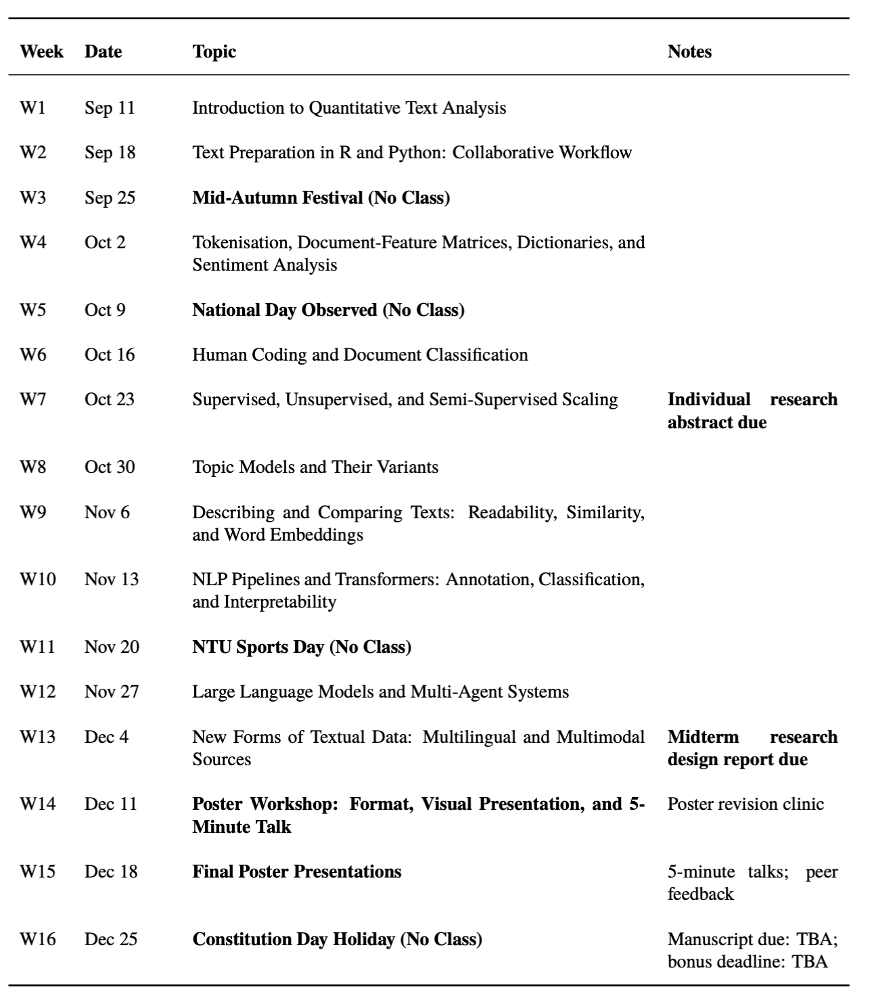
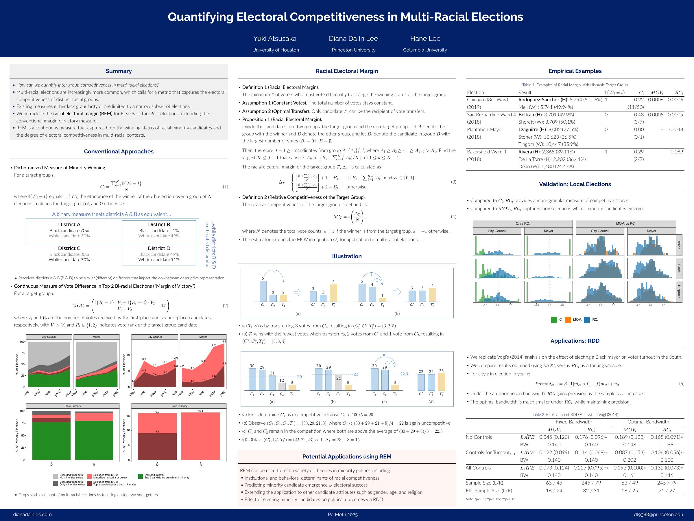
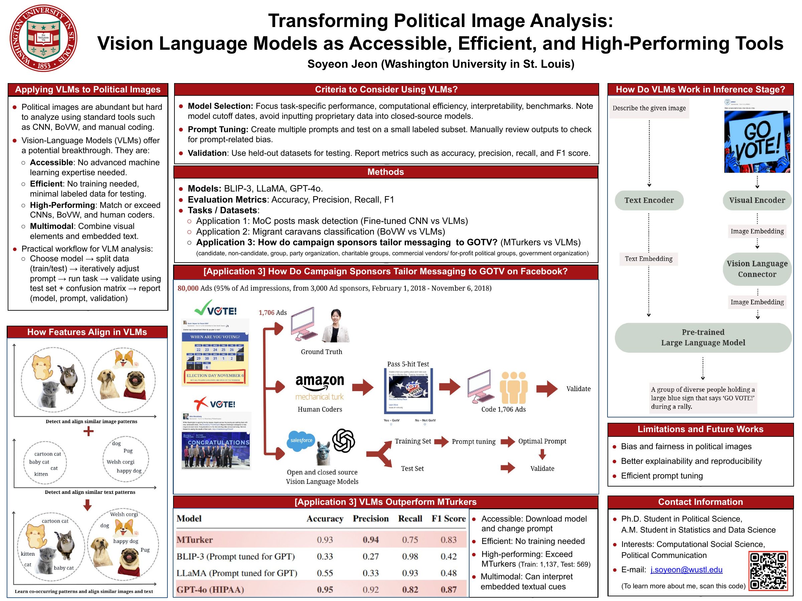
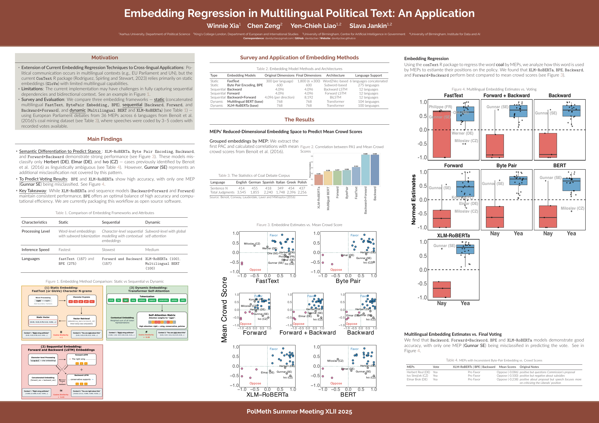
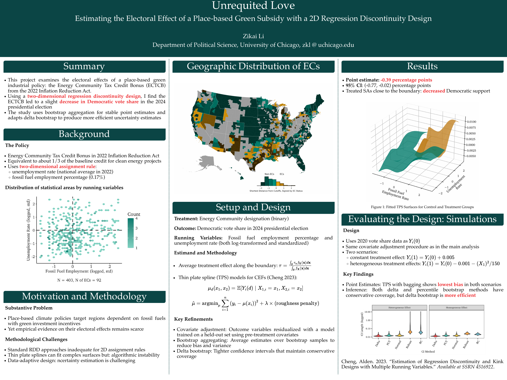
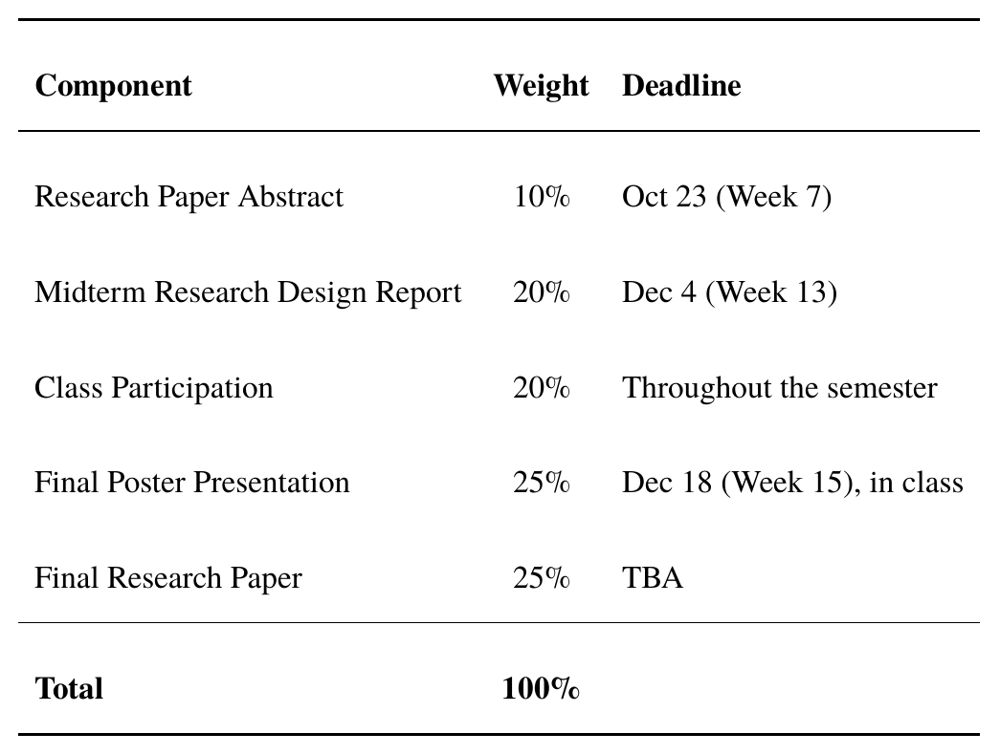

```{r setup, include=FALSE}
library(knitr)
library(ggplot2)
library(dplyr)
red_pink   = "#e64173"
turquoise  = "#20B2AA"
orange     = "#FFA500"
red        = "#fb6107"
blue       = "#3b3b9a"
green      = "#8bb174"
grey_light = "grey70"
grey_mid   = "grey50"
grey_dark  = "grey20"
purple     = "#6A5ACD"
opts_chunk$set(
  comment = "#>",
  fig.align = "center",
  fig.height = 6,
  fig.width = 9,
  warning = FALSE,
  message = FALSE,
  dev = "svg"
)


```

## Part 1 &mdash; Text as Data in Political Science

:::::::::::: {.slide-body}

[what it is, how the field got here, what it is used for]{.muted}

::::::::::::


## Why Text? {#overview}

:::::::::::: {.slide-body}

[Most political activity leaves a **textual/digital trace**.]{.accent-slate .lead}

- Parliamentary speeches, hearing transcripts, party manifestos

- Court rulings, bills, administrative records, diplomatic cables

- News coverage, social media posts, politicians' tweets

- Open-ended survey responses, interview transcripts

[**Then:**]{.accent-slate} human reading and hand coding (e.g., the Manifesto Project)

[**Now:**]{.accent-slate} [**scale**]{.accent-blue} — millions of documents can be analyzed systematically

::::::::::::

## What Is "Text as Data"?

:::::::::::: {.slide-body}

[Treat text as **data**: turn unstructured language/data into analyzable quantitative information to answer social-science questions.]{.accent-slate .lead}

[**Quantitative text analysis** and **NLP** are the toolkit; the social-science question is the job.]{.muted}

:::::::::: {.fragment}

::::::::: {style="text-align:center;"}

[**corpus**]{.accent-slate} [→]{.muted} [**representation**]{.accent-slate} [→]{.muted} [**model**]{.accent-slate} [→]{.muted} [**validation**]{.accent-slate} [→]{.muted} [**inference**]{.accent-slate}

:::::::::

- **Representation**: bag of words, word embeddings, language models

- **Model**: dictionaries, classifiers, topic models, scaling

- **Validation**: comparison with hand coding, expert judgment, external criteria

::::::::::

::::::::::::

## How the Field Got Here

:::::::::::: {.slide-body}

```{=html}
<svg viewBox="0 0 940 392" style="width:100%;height:auto;" xmlns="http://www.w3.org/2000/svg">
  <defs>
    <marker id="ar" viewBox="0 0 10 10" refX="9" refY="5" markerWidth="7" markerHeight="7" orient="auto">
      <path d="M0,0 L10,5 L0,10 z" fill="#9aa5a5"/>
    </marker>
  </defs>

  <g class="timeline-stage" data-stage="bag-of-words">
    <rect x="4"   y="34" width="282" height="252" rx="8" fill="#f4f6f5" stroke="#20B2AA" stroke-width="2"/>
    <text x="20"  y="22" font-size="19" font-weight="700" fill="#20B2AA">2003–2010 &#183; Bag of words</text>
    <text x="20" y="66"  font-size="17" font-weight="700" fill="#314f4f">Wordscores (2003)</text>
    <text x="20" y="86"  font-size="14" fill="#6b7575">Laver, Benoit &amp; Garry &#183; APSR</text>
    <text x="20" y="146" font-size="17" font-weight="700" fill="#314f4f">Wordfish (2008)</text>
    <text x="20" y="166" font-size="14" fill="#6b7575">Slapin &amp; Proksch &#183; AJPS</text>
    <text x="20" y="226" font-size="17" font-weight="700" fill="#314f4f">Expressed agenda (2010)</text>
    <text x="20" y="246" font-size="14" fill="#6b7575">Grimmer &#183; Political Analysis</text>
  </g>

  <g class="timeline-stage fragment" data-stage="validation" data-fragment-index="0">
    <rect x="329" y="34" width="282" height="252" rx="8" fill="#f4f6f5" stroke="#314f4f" stroke-width="2"/>
    <line x1="292" y1="160" x2="323" y2="160" stroke="#9aa5a5" stroke-width="2.5" marker-end="url(#ar)"/>
    <text x="345" y="22" font-size="19" font-weight="700" fill="#314f4f">2013–2014 &#183; Validation</text>
    <text x="345" y="66"  font-size="17" font-weight="700" fill="#314f4f">Promise and Pitfalls (2013)</text>
    <text x="345" y="86"  font-size="14" fill="#6b7575">Grimmer &amp; Stewart &#183; Political Analysis</text>
    <text x="345" y="106" font-size="13" fill="#6b7575">the four principles &#8212; and &#8220;validate&#8221;</text>
    <text x="345" y="176" font-size="17" font-weight="700" fill="#314f4f">Structural topic model (2014)</text>
    <text x="345" y="196" font-size="14" fill="#6b7575">Roberts et al. &#183; AJPS</text>
    <text x="345" y="216" font-size="13" fill="#6b7575">topics as a function of covariates</text>
  </g>

  <g class="timeline-stage fragment" data-stage="meaning-in-context" data-fragment-index="1">
    <rect x="654" y="34" width="282" height="252" rx="8" fill="#f4f6f5" stroke="#6A5ACD" stroke-width="2"/>
    <line x1="617" y1="160" x2="648" y2="160" stroke="#9aa5a5" stroke-width="2.5" marker-end="url(#ar)"/>
    <text x="670" y="22" font-size="19" font-weight="700" fill="#6A5ACD">2023– &#183; Meaning in context</text>
    <text x="670" y="66"  font-size="17" font-weight="700" fill="#314f4f">Embedding regression (2023)</text>
    <text x="670" y="86"  font-size="14" fill="#6b7575">Rodr&#237;guez, Spirling &amp; Stewart &#183; APSR</text>
    <text x="670" y="106" font-size="13" fill="#6b7575">what a word means, by party and era</text>
    <text x="670" y="176" font-size="17" font-weight="700" fill="#314f4f">LLMs as annotators (2024)</text>
    <text x="670" y="196" font-size="14" fill="#6b7575">Heseltine &amp; Clemm von Hohenberg</text>
    <text x="670" y="214" font-size="14" fill="#6b7575">Research &amp; Politics</text>
  </g>

  <text x="4" y="330" font-size="17" fill="#314f4f">What each stage added:</text>
  <text x="4" y="360" font-size="17" font-weight="700" fill="#20B2AA">bag of words<tspan class="fragment" data-fragment-index="0"><tspan fill="#9aa5a5" font-weight="400"> &#8594; </tspan><tspan fill="#314f4f">validation &amp; covariates</tspan></tspan><tspan class="fragment" data-fragment-index="1"><tspan fill="#9aa5a5" font-weight="400"> &#8594; </tspan><tspan fill="#6A5ACD">meaning in context</tspan><tspan fill="#9aa5a5" font-weight="400"> &#8594; </tspan><tspan fill="#fb6107">models that label for you</tspan></tspan></text>
  <g class="fragment" data-fragment-index="1">
    <text x="4" y="386" font-size="16" font-weight="700" fill="#314f4f">Validation is the one demand that never went away.</text>
  </g>
</svg>
```

::::::::::::

::: {.source}
Sources: Laver et al. (2003); Slapin & Proksch (2008); Grimmer (2010)[; Grimmer & Stewart (2013); Roberts et al. (2014)]{.fragment data-fragment-index="0"}[; Rodríguez et al. (2023); Heseltine & Clemm von Hohenberg (2024)]{.fragment data-fragment-index="1"}
:::

## Roadmap: Two Tasks

:::::::::::: {.slide-body}

[Text-as-data research does **two** different things.]{.accent-slate .lead}

:::::::::: {.columns}

::::::::: {.column width="48%"}

[**Measurement**]{.accent-slate}

- How do we turn a concept into a credible text-based measure?
- Contribution: new **method**, new **measure**, new **dataset**
- Star of the show: the method itself

:::::::::

::::::::: {.column width="48%"}

[**Application**]{.accent-slate}

- What substantive question does the measure answer?
- Contribution: new **empirical finding**, theory test
- Star of the show: research design and identification

:::::::::

::::::::::

:::::::::: {.fragment}

- The textbook (Grimmer, Roberts & Stewart 2022) has three tasks: **discovery**, **measurement**, **inference**.
- Here we collapse them: [measurement]{.accent-blue} ≈ discovery + measurement; [application]{.accent-purple} ≈ inference.

::::::::::

::::::::::::

## Example 1: From Pork to Policy

:::::::::::: {.slide-body}

:::::::::: {.columns}

::::::::: {.column width="64%"}

```{r echo=FALSE, out.width="100%"}

```

:::::::::

::::::::: {.column width="32%"}

[**Method: an existing tool, not a new one**]{.accent-slate}

LDA (2003), every topic validated by reading.

:::::::: {.fragment}

[**The contribution is the political science, not a new algorithm.**]{.accent-purple}

Building new NLP models is computer science's job; ours is to use them well to answer a question.

::::::::

:::::::::

::::::::::

::::::::::::

::: {.source}
Catalinac (2016), *The Journal of Politics* 78(1): 1–18
:::

## Example 2: Open-Ended Answers as Causal Graphs

:::::::::::: {.slide-body .small style="font-size:24px;"}

:::::::::: {.columns}

::::::::: {.column width="48%"}

[**Jankin, Liao & Tang (2026)**]{.accent-slate}

*Folk Theories of Partisan Conflict*

- **Question**: does it matter *why* a partisan thinks the country split — over and above **how much** they dislike the other side?
- **Data**: 1,200 US adults, quota-matched; several open-ended items (the graphs here code Q7)

:::::::::

::::::::: {.column width="48%"}

[**The prompt**]{.accent-slate}

[*"Which factors, events, groups, or institutions do you think caused Democrats and Republicans to view each other more negatively than they did 50 years ago? Please explain what caused what, who or what you think was responsible, and what effects followed."*]{.accent-slate}

:::::::::

::::::::::

[**The measurement move:**]{.accent-blue} code each free-text answer as a [**directed acyclic graph**]{.accent-purple} — nodes are the factors the respondent names (15 factors, 3 domains), edges are the causal links they draw between them.

::::::::::::

## Example 2: Open-Ended Answers as Causal Graphs

:::::::::::: {.slide-body .small}

::::::::::: {.columns}

::::::::: {.column width="58%"}

```{r echo=FALSE, out.width="100%"}

```

:::::::::: {.fine-print style="text-align:center;"}

[Jankin, Liao & Tang (2026), Fig. 4: popular folk theories of the divide, grouped by root cause (% = within-party share)]{.muted}

::::::::::

:::::::::

::::::::: {.column width="38%"}

- **Same factors, opposite arrows** — only the direction tells the theories apart; the graph gives each person's [**root cause**]{.accent-purple}.

- [**Validated:**]{.accent-red} coders agree on which factors each answer names (**κ = 0.84**); an LLM with the same codebook matches them (**F1 = 0.92**). [**Role of text:**]{.accent-blue} the theory you hold predicts tolerance of anti-democratic action, net of affect and ideology.

:::::::::

:::::::::::

::::::::::::

## Part 2 &mdash; How This Course Works

:::::::::::: {.slide-body}

[policy, schedule, assessment]{.muted}

::::::::::::


## Who This Course Is For

:::::::::::: {.slide-body}

[A **social science** course — [not a technology course]{.accent-red}.]{.accent-slate .lead}

[***This is an introductory course designed for students in the Graduate Institute of National Development and related social science disciplines. No advanced technical training is required. Instead, the course emphasizes how text-as-data and NLP techniques can be applied to answer substantive research questions in political science, political communication, legal studies, sociology, and other social science fields.***]{.accent-slate}

- [**Want the technical detail?**]{.accent-red} Model internals, architectures, optimization — [this is not that course.]{.muted}

- [**The goal:**]{.accent-blue} your own [**political science / social science paper**]{.accent-purple}, written with these methods.

::::::::::::

## Where the Course Material Comes From

:::::::::::: {.slide-body .small style="font-size:23px;"}

:::::::::: {.columns}

::::::::: {.column width="48%"}

```{r echo=FALSE, out.width="58%"}

```

:::::::::

::::::::: {.column width="48%"}

[**The framework behind these lectures**]{.accent-slate}

[Grimmer, Roberts & Stewart (2022)]{.accent-slate} — *Text as Data: A New Framework for Machine Learning and the Social Sciences*, Princeton University Press

- Our two tasks simplify this book's **discovery → measurement → inference** framework

[**You do not need to buy it.**]{.accent-red} This course is [**paper-first**]{.accent-blue} — 3–4 core items a week, mostly journal articles and open tutorials. Required book chapters are provided as excerpts.

[**Also useful:**]{.accent-slate} [Benoit (2020) · Nielbo et al. (2024) · Watanabe & Müller, *quanteda tutorials* · Jurafsky & Martin, *SLP* (free online)]{.fine-print}

:::::::::

::::::::::

::::::::::::

## Course Schedule: 16 Weeks

:::::::::::: {.slide-body}

```{r echo=FALSE, out.width="44%"}

```

::::::::::::

## Course Schedule: 16 Weeks

:::::::::::: {.slide-body .small}

:::::::::: {.columns}

::::::::: {.column width="50%"}

[**The term in three blocks.**]{.accent-slate .lead}

[**W1–W2 · Foundations**]{.accent-blue}  
Introduction to QTA; text preparation and R/Python collaborative workflows.

[**W4–W8 · Core methods**]{.accent-slate}  
Tokenisation and DFMs; dictionaries and sentiment; human coding and classification; scaling; topic models.

[**W9–W13 · Advanced representations**]{.accent-purple}  
Readability, similarity and embeddings; NLP and transformers; LLMs; multilingual and multimodal sources.

:::::::::

::::::::: {.column width="46%"}

[**Dates worth writing down**]{.accent-slate}

- **W7 · Oct 23** — individual research abstract due
- **W13 · Dec 4** — midterm research design report due
- **W14 · Dec 11** — poster workshop
- **W15 · Dec 18** — final poster presentations
- **Manuscript and bonus deadlines: TBA**

:::::::::

::::::::::

::::::::::::

::: {.source}
No class: W3 (Sep 25) · W5 (Oct 9) · W11 (Nov 20) · W16 (Dec 25).
:::

## What You Need Before We Start

:::::::::::: {.slide-body}

[This course requires prior experience with R and comfort running some code in a Python environment.]{.accent-slate} [No advanced technical training beyond that.]{.muted}

:::::::::: {.columns}

::::::::: {.column width="48%"}

**R — most lectures and methods**

quanteda, tidytext, text2vec, udpipe, keyATM, spacyr

:::::::::

::::::::: {.column width="48%"}

**Python — selectively**

transformers, flair (transformer models); gensim, spacy (NLP toolkits); BERTopic (topic models)

:::::::::

::::::::::

[You should bring a laptop with a working development environment already set up]{.accent-red} — most sessions mix a short lecture with coding exercises you run yourself. [A detailed setup guide is sent before the first class.]{.muted}

::::::::::::

## What You Need Before We Start

:::::::::::: {.slide-body}

[IDE: RStudio for R, Positron for Python and cross-language work.]{.accent-slate}

You should be able to edit and run code, debug, manage packages, and use the integrated terminal.

[R Markdown / Quarto (RStudio) and Jupyter / Quarto notebooks (Positron) are helpful but not required — we cover the practical setup and workflow in Week 2.]{.muted}

[New to these IDEs? Complete a basic tutorial before Week 2]{.accent-red} — so the term is spent on methods, not on fighting your tools.

[Written coursework and posters use **LaTeX in shared Overleaf projects**. **Quarto** can be used for analysis notebooks. [Optional: we may use LM Studio to run LLaMA or Mistral locally, with no API costs.]{.muted}]{.fine-print}

::::::::::::

## What You Need Before We Start

:::::::::::: {.slide-body .small}

[GitHub for code; Overleaf for written coursework.]{.accent-slate}

Course materials — lectures, code, data, and practice exercises — are on GitHub. Develop research code in a **private repository**. Submit written coursework through **shared Overleaf projects with instructor editing access**.

[No Git experience required.]{.accent-blue} We use **GitHub Desktop** (desktop.github.com) — point-and-click, no command line. RStudio and Positron have built-in Git tools too.

**Recommended:** apply for the free **GitHub Student Developer Pack** (education.github.com/pack) with your university email. It gives you GitHub Pro, Copilot, and other developer tools at no cost.

[**Week 1:** course rules, expectations, and how materials, coursework, and communication are organized. **Week 2:** GitHub Desktop and IDE setup — cloning, committing, and sharing code.]{.fine-print}

::::::::::::

## What You Need Before We Start

:::::::::::: {.slide-body}

[This is a 2-credit course. Plan on roughly 3 hours per week outside class.]{.accent-slate}

| Activity | Hours / week |
| :--- | :---: |
| **Before class** — read the assigned text-as-data papers, review the week's slides | 1–2 |
| **After class** — self-study coding practice and research-project development | 1–2 |
| **Typical weekly total (outside class)** | about 3 |

[On the readings:]{.accent-slate} the assigned papers come from political science and the social sciences and use text-as-data methods on real research problems. [We read them for the methods and how they are applied, not for their substantive findings.]{.accent-purple}

::::::::::::

## Practice and Class Participation

:::::::::::: {.slide-body}

[**Self-Study Coding Practice**]{.accent-slate}

Lab files provide worked examples and exercises for practising course methods.

[These practice exercises are ungraded; no lab submission is required.]{.accent-blue}

[**Class Participation — 20%**]{.accent-slate} &nbsp; Active engagement in:

:::::::::: {.columns}

::::::::: {.column width="48%"}

- Discussion of readings, methods, and applications
- Peer feedback activities

:::::::::

::::::::: {.column width="48%"}

- Questions and answers on NTU COOL or course-code GitHub Issues

:::::::::

::::::::::

[[Written coursework and posters are prepared in LaTeX and submitted through shared Overleaf projects.]{.fine-print}]{.muted}

::::::::::::

## Final Poster Presentation

:::::::::::: {.slide-body}

[**Final Poster Presentation — 25%**]{.accent-slate}

[Week 15 poster session.]{.lead}

You present a **5-minute overview** of your poster, followed by discussion and peer feedback. You are [expected to remain by your poster throughout the session]{.accent-red} to answer questions. Faculty members may be invited to attend.

Posters should follow **PolMeth poster guidelines** ([polmeth.emory.edu/instructions.html]{.fine-print}): clear visual design emphasizing the research question, data and methods, key findings, and implications.

[Week 14 is a preparatory poster workshop]{.accent-purple} — poster format, visual presentation, and the 5-minute talk. It counts toward class participation.

::::::::::::

## Poster Presentation: Four Examples {.poster-examples}

:::::::::::: {.slide-body}

```{=html}
<div class="poster-grid">
  <figure class="poster-card">
    
    <figcaption>Atsusaka, Lee &amp; Lee (2025)</figcaption>
  </figure>
  <figure class="poster-card">
    
    <figcaption>Jeon (2025)</figcaption>
  </figure>
  <figure class="poster-card">
    
    <figcaption>Xia, Zeng, Liao &amp; Jankin (2025)</figcaption>
  </figure>
  <figure class="poster-card">
    
    <figcaption>Li (2025)</figcaption>
  </figure>
</div>
```

::::::::::::

::: {.source}
PolMeth 2025 poster examples · Compare the research question, evidence, and visual organization.
:::


## Your Two Papers

:::::::::::: {.slide-body}

[[Midterm Research Design Report — 20%.]{.accent-slate}]{.lead}

[Your own research project or thesis]{.accent-slate}, written as [independent work]{.accent-red}. The midterm sets up the study that the final paper completes.

:::::::::: {.columns}

::::::::: {.column width="48%"}

**What it must contain**

- Abstract
- Introduction: question and motivation
- Literature review situating the study
- Research design: data, methods, strategy

:::::::::

::::::::: {.column width="48%"}

**And then**

- Preliminary results, or the planned analytical strategy
- Feasibility, expected findings, contribution

[Up to 10 pages, no more than 2,500 words.]{.accent-red} [Due: December 4 (Week 13).]{.muted}

:::::::::

::::::::::

::::::::::::

## Your Two Papers

:::::::::::: {.slide-body}

[[Final paper — 25%.]{.accent-slate}]{.lead}

Also independent work. Build on the midterm and [complete it with the full empirical analysis]{.accent-slate} — stronger design, robust inference, proper validation and sensitivity tests, then findings, limitations, contribution.

- [Main text: up to 4,000 words, excluding references]{.accent-red}, written as a **PSRM Research Note**
- [Appendix: no word or page limit]{.accent-blue} — robustness checks, alternative specifications, validation, annotation protocols, prompts, model details, code documentation
- [A reproducible code repository]{.accent-red}, on GitHub or CodeOcean
- [Due: TBA]{.muted}

::::::::::::

## Your Two Papers

:::::::::::: {.slide-body}

[[Where to start.]{.accent-slate}]{.lead}

The syllabus lists these as suggested topics, if you do not already have a corpus in mind.

:::::::::: {.columns}

::::::::: {.column width="48%"}

**Legislatures and parties**

- Taiwan legislative behavior: roll call votes, speeches, parliamentary questions
- Legislative speech analysis
- Party manifestos, across countries or over time

:::::::::

::::::::: {.column width="48%"}

**Media and rhetoric**

- Social media political discourse
- News framing of political issues
- Comparative political rhetoric
- CCP wolf warrior diplomacy and propaganda

:::::::::

::::::::::

[Pick something you can still be working on at the Week 15 poster session.]{.accent-purple}

::::::::::::

## Grading

:::::::::::: {.slide-body .small}

:::::::::: {.columns}

::::::::: {.column width="60%"}

```{r echo=FALSE, out.width="100%"}

```

:::::::::

::::::::: {.column width="36%"}

- [**Research abstract**]{.accent-slate} — proposed title and up to **1,000 words**; due **Oct 23**

- [**Midterm report → final paper**]{.accent-slate} — develop one original research project

- [**Poster presentation**]{.accent-slate} — workshop in W14; presentation in W15

- [**Coding practice**]{.accent-slate} — ungraded; no submission

- Submit assessed work via [**Overleaf**]{.accent-slate}; up to [**15% extra credit**]{.accent-blue}

:::::::::

::::::::::

::::::::::::

::: {.source}
Details: syllabus §8.1.
:::

## Bonus: Up to 15% Extra Credit

:::::::::::: {.slide-body}

[Two bonuses: a conference acceptance, or an actual journal submission.]{.accent-slate}

**Conference acceptance — up to [5%]{.accent-slate}**

[APSA (early Jan), MPSA (Nov), EPSS (late Dec), COMPTEXT (early Jan), TPSA (summer), JSQPS (late Oct for Winter, Jul/Aug for Summer); PolMeth — Annual Meeting (Mar), Europe PolMeth (mid-to-late Nov), Asian PolMeth (mid-to-late Oct). Months shown are typical submission deadlines, not meeting dates.]{.fine-print}

**Journal submission — up to [10%]{.accent-slate}**

[Revise & Resubmit, or major/minor revision: [+10%]{.accent-blue}. Reject or desk reject: [+5%]{.accent-blue}. Eligible journals: SSCI-indexed political science or social science journals.]{.fine-print}

[Land both and you can claim both — 15% maximum.]{.accent-purple}

::::::::::::

## Bonus: Up to 15% Extra Credit

:::::::::::: {.slide-body}

[What you have to show, and what makes a submission ineligible.]{.accent-slate}

**Proof:** the confirmation email showing the submission **and** the decision letter.

[Not eligible:]{.accent-red} [a submission that breaches NTU regulations on academic integrity, research ethics, student conduct, authorship, copyright, data protection, or generative-AI use, or the rules of the relevant conference or journal. It may also be handled under the relevant NTU procedures.]{.fine-print}

[[Writing an MA thesis? You are encouraged to develop thesis-related submissions with your thesis supervisor. GIND students: a thesis-related co-authored submission must be co-authored with a faculty member affiliated with the Graduate Institute of National Development. For any thesis-related co-authored submission, you must be listed as both **first author** and **corresponding author** to claim the bonus.]{.fine-print}]{.muted}

::::::::::::

## Bonus: Up to 15% Extra Credit

:::::::::::: {.slide-body .small}

[Affiliation and geographic identification — required in every bonus submission.]{.accent-slate}

Use the official name **National Taiwan University** in the manuscript text, submission metadata, cover letter, acknowledgements, slides, posters, and any public-facing materials.

[Do not alter, omit, or downgrade the university name]{.accent-red}, and do not use wording that misrepresents or diminishes Taiwan's status. Where a location is required, use "Taipei, Taiwan" or "Taipei, Taiwan (R.O.C.)".

[This does not prohibit evidence-based criticism of Taiwanese politics, institutions, or public policy. It applies to accurate affiliation, geographic description, professional conduct, and non-misleading representation.]{.fine-print}

[If a conference, journal, submission system, or editor asks for wording that changes NTU or Taiwan, you must consult me before proceeding — and you are strongly encouraged to discuss any submission plan with me in advance.]{.accent-blue}

::::::::::::

## Using Generative AI

:::::::::::: {.slide-body .small}

[This course follows NTU's **Guidelines for the Use of Generative AI and Research Integrity**. AI is a support tool: it does not replace your judgment or your responsibility for what you submit.]{.accent-slate}

[**1. Permitted uses in your assignments**]{.accent-blue} — conceptualisation; initial literature screening, for human verification; supporting writing and editing; audiovisual and interactive components. The argument and the analysis stay your own.

[**2. Disclose AI use in every submission**]{.accent-purple} — research abstract, midterm report, poster, final paper, and bonus submission. State which tool and version, what you asked it to do, how you used the output, and how you checked it. No AI used? Write: ["No generative AI tools were used in the preparation of this assignment."]{.muted}

[**3. No declaration, no acceptance.**]{.accent-red} An assignment without a declaration is not accepted until a complete one is provided. Misrepresenting AI use, failing to verify AI output, fabricating sources or data through AI, or using AI to bypass a learning goal may be treated as academic misconduct.

::::::::::::

## Academic Integrity and Deadlines

:::::::::::: {.slide-body .small}

:::::::::: {.columns}

::::::::: {.column width="56%"}

[**Integrity**]{.accent-slate}

- Acknowledge every source of ideas, text, code, data, figures, tables, and research materials that is not your own
- Plagiarism includes copying or close paraphrasing without citation, reusing your own past work unacknowledged, unauthorized collaboration, fabricated data or references, and AI-generated material without the required disclosure
- This course follows NTU policies: suspected misconduct may receive [a zero on the relevant component]{.accent-red}; serious or repeated cases may be referred to the department, college, or university

:::::::::

::::::::: {.column width="40%"}

[**Deadlines**]{.accent-slate}

- Deadlines hold. If you cannot meet one, notify me as early as possible and use the NTU student leave procedure; in urgent cases, email me first
- Approved leave, or an approved extension, does not automatically waive the work; I arrange a reasonable make-up when appropriate
- No approved leave and no prior approval: [absent for missed in-class activities; late work may receive no credit]{.accent-red}

:::::::::

::::::::::


::::::::::::

::: {.source}
Details: syllabus §9.1 and §9.3 · NTU student leave procedure: advisory.ntu.edu.tw/CMS/Page/44
:::

## Dignity, Respect, and Support

:::::::::::: {.slide-body .small}

National Taiwan University is committed to a **respectful, inclusive, and safe learning environment**.

You have the right to study free from bullying, harassment, discrimination, sexual harassment, sexual assault, sexual bullying, stalking, and other conduct that undermines dignity or safety.

This course reads politically sensitive material. Disagreement is expected, but it stays [evidence-based, professional, and respectful]{.accent-slate} — argue with the evidence, not the person.

If you experience or witness harassment, gender-based misconduct, discrimination, bullying, or a threat to your safety, you are encouraged to seek support. Reports are handled under the relevant NTU procedures.

[You are also welcome to contact me directly]{.accent-blue} — I will help you find the right route.

::::::::::::

## Dignity, Respect, and Support

:::::::::::: {.slide-body}

:::::::::: {.small style="font-size:22px;"}

::::::::: {.columns}

:::::::: {.column width="48%"}

**Reporting**

Gender Equity Education Committee (性別平等教育委員會) complaint lines: **(02) 3366-9607** / **(02) 3366-9608**, gender@ntu.edu.tw

NTU sexual harassment prevention contact line: **(02) 3366-5903**, leader@ntu.edu.tw

Or speak to me first if you prefer.

::::::::

:::::::: {.column width="48%"}

**Support and emergencies**

Student Counseling Center: **(02) 3366-2181**, my.ntu.edu.tw/counsel — an initial intake appointment is required; walk-ins welcome in urgent situations

In-college student support, a counselor based in your own college (walk-ins welcome): csw.ntu.edu.tw

Campus Security Center, **24 hours: (02) 3366-9119**

If life or physical safety is in danger: **119** (medical) or **110** (police)

Free national hotlines, 24 hours: Mental Health Care Line **1925**; Lifeline **1995**

::::::::

:::::::::

::::::::::

[Save the 24-hour numbers in your phone now, before you need them.]{.fine-print}

::::::::::::

## Before You Leave: Background Survey

:::::::::::: {.slide-body}

:::::::::: {.columns}

::::::::: {.column width="48%"}

[**Take five minutes now.**]{.accent-slate .lead}

[**Student Background and Course Expectations**]{.accent-slate}

- Where you are with **R**, **Python**, and text analysis
- What you want out of the course, and what you are working on
- I use the answers to set the pace of the labs and pick examples that fit your projects

[**Scan the code and fill it in before you go.**]{.accent-blue}

:::::::::

::::::::: {.column width="48%"}

```{r echo=FALSE, out.width="78%"}

```

:::::::::

::::::::::

::::::::::::

## Before Next Week

:::::::::::: {.slide-body .small}

[**W2: R, Python, GitHub, and Collaborative Workflow**]{.accent-slate .lead}

- Bring a laptop with a **working development environment** — we build on it every week

- Install [**RStudio**]{.accent-slate} (R) or [**Positron**]{.accent-slate} (Python and cross-language work); a setup guide goes out before class

- Create a free [**GitHub account**]{.accent-slate} and install [**GitHub Desktop**]{.accent-slate} — [no command-line Git required]{.muted}

- [**Recommended:**]{.accent-blue} apply for the free **GitHub Student Developer Pack** with your NTU email — GitHub Pro and Copilot at no cost

[**Reading for W2**]{.accent-slate}: *quanteda tutorials*, Ch. 1 · Grimmer, Roberts & Stewart (2022), Ch. 4 [(excerpt provided)]{.fine-print} · Quarto "Get Started" docs · Posit blog, *Privacy and AI Assistants* [(skim)]{.fine-print}

[Catching up on W1? Benoit (2020) · Grimmer & Stewart (2013) · Nielbo et al. (2024) · Egami et al. (2022)]{.fine-print}

::::::::::::

## References (1/4)

:::::: {.slide-body}

::: {.small}
**Grimmer & Stewart (2013)**  
Grimmer, J. & Stewart, B. M. (2013). Text as Data: The Promise and Pitfalls of Automatic Content Analysis Methods for Political Texts. *Political Analysis* 21(3): 267–297.

**Grimmer, Roberts & Stewart (2022)**  
Grimmer, J., Roberts, M. E. & Stewart, B. M. (2022). *Text as Data: A New Framework for Machine Learning and the Social Sciences*. Princeton University Press.

**Jankin, Liao & Tang (2026)**  
Jankin, S., Liao, Y.-C. & Tang, L. (2026). Folk Theories of Partisan Conflict. Working paper.

**Rodríguez, Spirling & Stewart (2023)**  
Rodríguez, P. L., Spirling, A. & Stewart, B. M. (2023). Embedding Regression: Models for Context-Specific Description and Inference. *American Political Science Review*. [doi:10.1017/s0003055422001228](https://doi.org/10.1017/s0003055422001228)
:::

::::::


## References (2/4)

:::::: {.slide-body}

::: {.small}
**Benoit (2020)**  
Benoit, K. (2020). Text as Data: An Overview. In L. Curini & R. Franzese (eds.), *The SAGE Handbook of Research Methods in Political Science and International Relations*: 461–497. Sage. [doi:10.4135/9781526486387.n29](https://doi.org/10.4135/9781526486387.n29)

**Egami et al. (2022)**  
Egami, N., Fong, C. J., Grimmer, J., Roberts, M. E. & Stewart, B. M. (2022). How to Make Causal Inferences Using Texts. *Science Advances* 8(42): eabg2652. [doi:10.1126/sciadv.abg2652](https://doi.org/10.1126/sciadv.abg2652)

**Grimmer (2010)**  
Grimmer, J. (2010). A Bayesian Hierarchical Topic Model for Political Texts: Measuring Expressed Agendas in Senate Press Releases. *Political Analysis* 18(1): 1–35. [doi:10.1093/pan/mpp034](https://doi.org/10.1093/pan/mpp034)

**Heseltine & Clemm von Hohenberg (2024)**  
Heseltine, M. & Clemm von Hohenberg, B. (2024). Large Language Models as a Substitute for Human Experts in Annotating Political Text. *Research & Politics* 11(1). [doi:10.1177/20531680241236239](https://doi.org/10.1177/20531680241236239)
:::

::::::


## References (3/4)

:::::: {.slide-body}

::: {.small}
**Jurafsky & Martin (2026)**  
Jurafsky, D. & Martin, J. H. (2026). *Speech and Language Processing* (3rd ed., online draft). [https://web.stanford.edu/~jurafsky/slp3/](https://web.stanford.edu/~jurafsky/slp3/)

**Laver, Benoit & Garry (2003)**  
Laver, M., Benoit, K. & Garry, J. (2003). Extracting Policy Positions from Political Texts Using Words as Data. *American Political Science Review* 97(2): 311–331. [doi:10.1017/s0003055403000698](https://doi.org/10.1017/s0003055403000698)

**Nielbo et al. (2024)**  
Nielbo, K. L. et al. (2024). Quantitative Text Analysis. *Nature Reviews Methods Primers* 4(1): 25. [doi:10.1038/s43586-024-00302-w](https://doi.org/10.1038/s43586-024-00302-w)

**Roberts et al. (2014)**  
Roberts, M. E., Stewart, B. M., Tingley, D. et al. (2014). Structural Topic Models for Open-Ended Survey Responses. *American Journal of Political Science* 58(4): 1064–1082. [doi:10.1111/ajps.12103](https://doi.org/10.1111/ajps.12103)
:::

::::::


## References (4/4)

:::::: {.slide-body}

::: {.small}
**Slapin & Proksch (2008)**  
Slapin, J. B. & Proksch, S.-O. (2008). A Scaling Model for Estimating Time-Series Party Positions from Texts. *American Journal of Political Science* 52(3): 705–722. [doi:10.1111/j.1540-5907.2008.00338.x](https://doi.org/10.1111/j.1540-5907.2008.00338.x)

**Watanabe & Müller (2023)**  
Watanabe, K. & Müller, S. (2023). *Quanteda Tutorials*. [https://tutorials.quanteda.io](https://tutorials.quanteda.io)
:::

::::::
